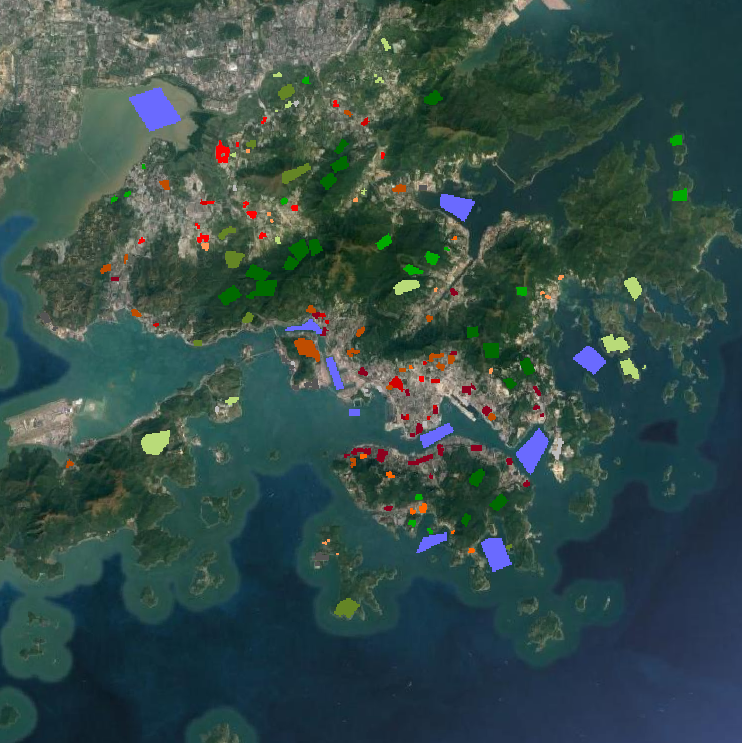
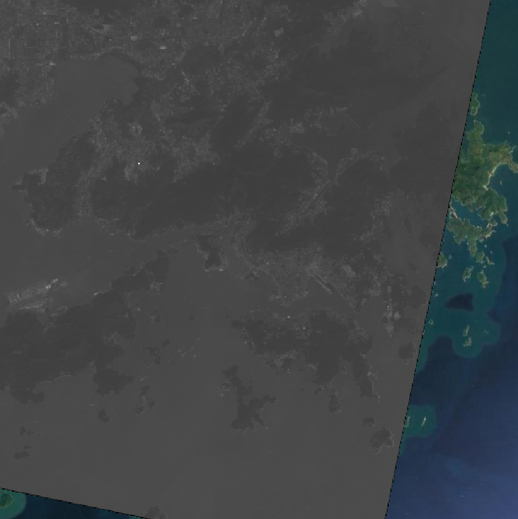
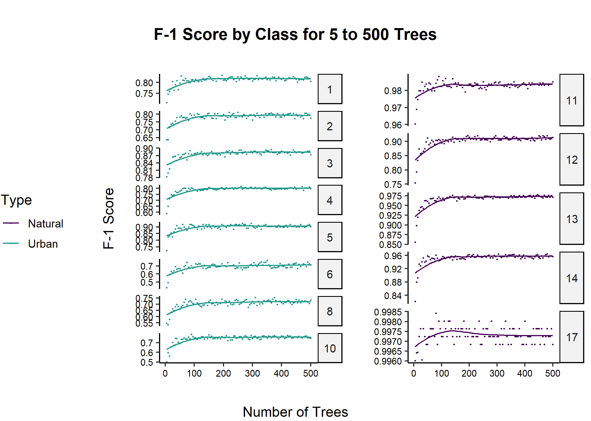
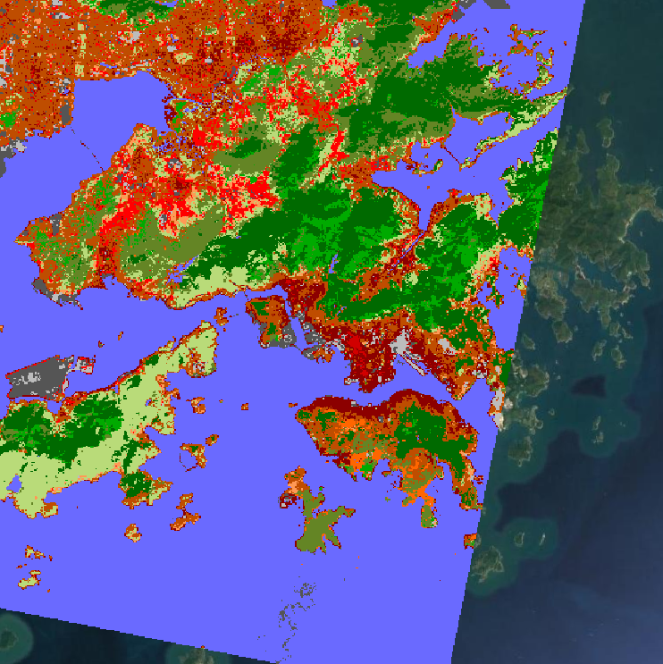
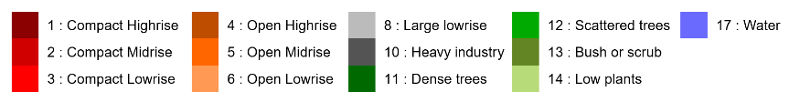

# Local Climate Zone Classification Using Random Forests

**The goal of this project was to replicate aspects of *[Comparison between convolutional neural networks and random forest for local climate zone classification in mega urban areas using Landsat images](https://doi.org/10.1016/j.isprsjprs.2019.09.009).* The report can be found [here.](https://github.com/erickabsmith/masters-project-lcz-classification/blob/main/doc/report/report.pdf)***

Local Climate Zone (LCZ) classification can be useful in identifying microclimates within cities that may be useful for targeting climate risk adaptation efforts, which can help alleviate the issues created by the Urban Heat Island Effect.

In this work the focus was on random forest without inclusion of convolutional neural networks. Rather than four cities, this investigation will focus on just Hong Kong. This city was chosen because each LCZ class has at least four polygons. The data used was accessed from the [2017 IEEE GRSS Data Fusion Contest](http://www.grss-ieee.org/2017-ieee-grss-data-fusion-contest/) anc includes both Landsat 8 imagery and LCZ reference data. The classification scheme used by the [World Urban Database and Access Portal Tools project](http://www.wudapt.org/) (S1 in the paper) will be recreated, with varying numbers of the tuning parameter ntree, which controls the number of trees in the random forest. Accuracy with out-of-bag data will be compared to that with the test dataset.

**Here's the inital LCZ data and one Landsat scene, both with a Google Maps satellite baselayer:**

## Results

The results from varying the tuning parameter indicate that there is an upper limit to how much the number of trees can affect the accuracy of the prediction, and it lies around 125 trees for OA metrics, and around 100 trees for F1 scores.

Results also indicate a lack of transferability between accuracy of predictions for the out-of-bag data as compared to that of the test dataset. This makes sense considering the spatial autocorrelation present in data such as these, but is concerning nonetheless. Additionally, OA metrics seem to mask low F1 scores in individual classes.

## A Full Prediction

Finally, here is an example of a full prediction from the best random forest:

