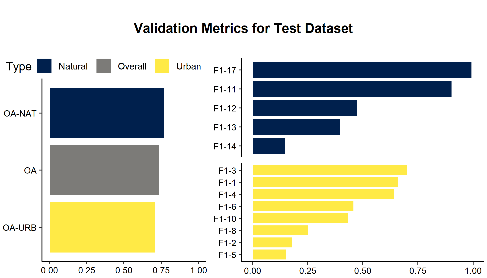

# Local Climate Zone Classification Using Random Forests

Local Climate Zone (LCZ) classification can be useful in identifying microclimates within cities that may be useful for targeting climate risk adaptation efforts, which can help alleviate the issues created by the Urban Heat Island Effect.

This investigation focused on Hong Kong. The inspiration is [this article](https://doi.org/10.1016/j.isprsjprs.2019.09.009) by Yoo et al. (2019) and the data used was accessed from the [2017 IEEE GRSS Data Fusion Contest](http://www.grss-ieee.org/2017-ieee-grss-data-fusion-contest/). It includes both Landsat 8 imagery and LCZ reference data. The classification scheme used by the [World Urban Database and Access Portal Tools project](http://www.wudapt.org/) (S1 in the paper) was recreated, with varying numbers of the tuning parameter ntree, which controls the number of trees in the random forest. Accuracy with out-of-bag data was compared to that with the test dataset.

**Here's the inital LCZ data and one Landsat scene, both with a Google Maps satellite baselayer:**

The polygons represent spaces that are classified already and used as "ground truth."

## Results

The results from varying the tuning parameter indicate that there is an upper limit to how much the number of trees can affect the accuracy of the prediction, and it lies around 125 trees for OA metrics, and around 100 trees for F1 scores.

Results also indicate a lack of transferability between accuracy of predictions for the out-of-bag data as compared to that of the test dataset. This makes sense considering the spatial autocorrelation present in data such as these, but is concerning nonetheless. 

Additionally, OA metrics seem to mask low F1 scores in individual classes, which suggests that random forests may be particularly inaccurate for certain classes of LCZs.

Finally, here is an example of a full prediction from the best random forest:

For a more in-depth explanation, please [go check out the report.](https://github.com/erickabsmith/masters-project-lcz-classification/blob/main/doc/report/report.pdf)
