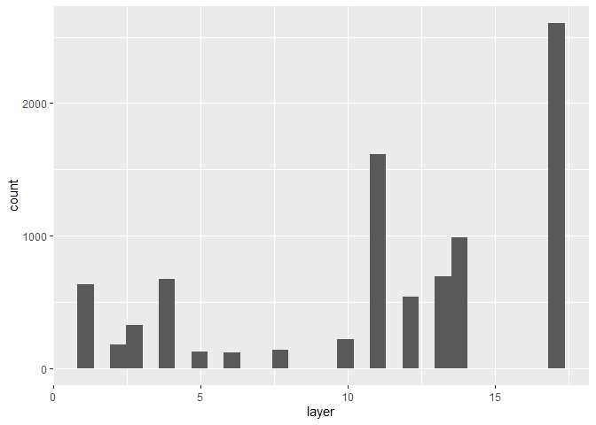
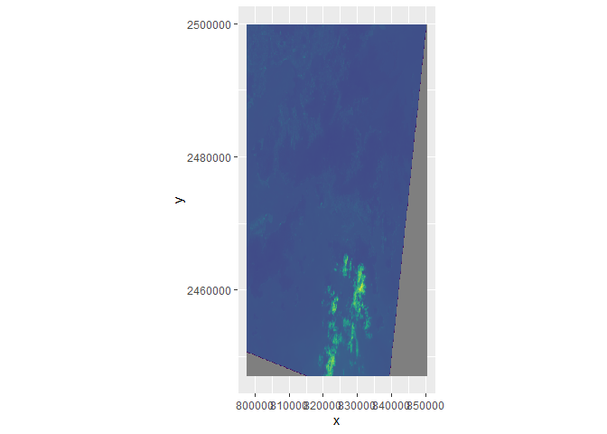
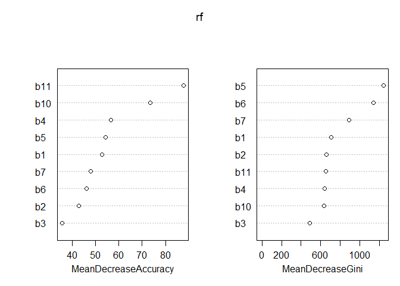
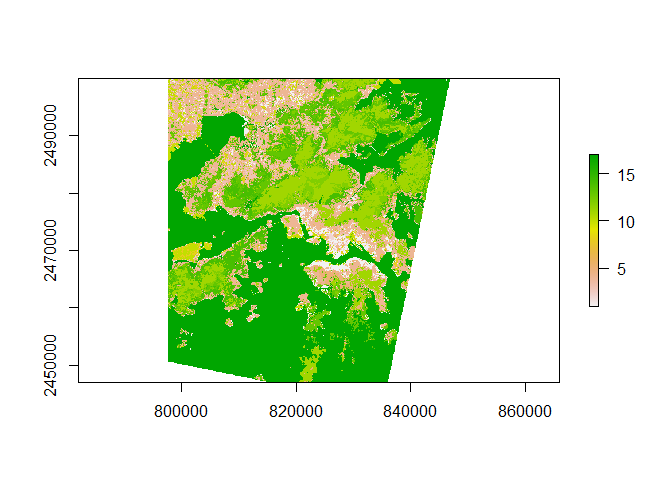

Getting the Hong Kong Data into R and making a random forest
================

libraries

``` r
library(randomForest)
```

    ## randomForest 4.6-14

    ## Type rfNews() to see new features/changes/bug fixes.

``` r
library(raster)
```

    ## Loading required package: sp

``` r
library(rgdal)
```

    ## rgdal: version: 1.5-19, (SVN revision 1092)
    ## Geospatial Data Abstraction Library extensions to R successfully loaded
    ## Loaded GDAL runtime: GDAL 3.0.4, released 2020/01/28
    ## Path to GDAL shared files: C:/Users/erick/Documents/R/win-library/4.0/rgdal/gdal
    ## GDAL binary built with GEOS: TRUE 
    ## Loaded PROJ runtime: Rel. 6.3.1, February 10th, 2020, [PJ_VERSION: 631]
    ## Path to PROJ shared files: C:/Users/erick/Documents/R/win-library/4.0/rgdal/proj
    ## Linking to sp version:1.4-4
    ## To mute warnings of possible GDAL/OSR exportToProj4() degradation,
    ## use options("rgdal_show_exportToProj4_warnings"="none") before loading rgdal.

``` r
library(here)
```

    ## here() starts at C:/Users/erick/Documents/MS_Project/masters-project-lcz-classification

``` r
library(tidyverse)
```

    ## -- Attaching packages ------------------------------------------------------------------------------------ tidyverse 1.3.0 --

    ## v ggplot2 3.3.2     v purrr   0.3.4
    ## v tibble  3.0.1     v dplyr   0.8.5
    ## v tidyr   1.0.3     v stringr 1.4.0
    ## v readr   1.3.1     v forcats 0.5.0

    ## -- Conflicts --------------------------------------------------------------------------------------- tidyverse_conflicts() --
    ## x dplyr::combine()  masks randomForest::combine()
    ## x tidyr::extract()  masks raster::extract()
    ## x dplyr::filter()   masks stats::filter()
    ## x dplyr::lag()      masks stats::lag()
    ## x ggplot2::margin() masks randomForest::margin()
    ## x dplyr::select()   masks raster::select()

``` r
library(mapproj)
```

    ## Loading required package: maps

    ## 
    ## Attaching package: 'maps'

    ## The following object is masked from 'package:purrr':
    ## 
    ##     map

``` r
#training <- readOGR('training_data.shp', layer='training_data')
train <- brick(here("data/hong_kong/lcz/", "hong_kong_lcz_gt.tif"))
#le7 <- brick('LE70220491999322EDC01_stack.gtif')
le8 <- brick(here("data/hong_kong/landsat_8", "LC81220442015291LGN00/LC81220442015291LGN00_B1.tif"))
```

``` r
all_data <- stack(le8, train)
```

``` r
summary(all_data)
```

    ## Warning in .local(object, ...): summary is an estimate based on a sample of 1e+05 cells (35.8% of all cells)

    ##              layer.1 layer.2
    ## Min.        9.053158       0
    ## 1st Qu. 10317.156738       0
    ## Median  10894.180664       0
    ## 3rd Qu. 11287.256348       0
    ## Max.    42234.699219      17
    ## NA's    32939.000000       0

Convert all into dataframes

``` r
all_data_df <- as.data.frame(all_data, xy=TRUE)
```

``` r
le8_df <- as.data.frame(le8, xy=TRUE)
train_df <- as.data.frame(train, xy=TRUE)
```

Compare three different dfs to see how `stack()` put things together

``` r
summary(all_data_df)
```

    ##        x                y              layer.1            layer.2       
    ##  Min.   :797658   Min.   :2447101   Min.   :    3.59   Min.   : 0.0000  
    ##  1st Qu.:810833   1st Qu.:2460301   1st Qu.:10316.70   1st Qu.: 0.0000  
    ##  Median :824008   Median :2473501   Median :10894.01   Median : 0.0000  
    ##  Mean   :824008   Mean   :2473501   Mean   :11176.77   Mean   : 0.3601  
    ##  3rd Qu.:837183   3rd Qu.:2486701   3rd Qu.:11287.58   3rd Qu.: 0.0000  
    ##  Max.   :850358   Max.   :2499901   Max.   :43000.50   Max.   :17.0000  
    ##                                     NA's   :33486

``` r
summary(le8_df)
```

    ##        x                y               layer         
    ##  Min.   :797658   Min.   :2447101   Min.   :    3.59  
    ##  1st Qu.:810833   1st Qu.:2460301   1st Qu.:10316.70  
    ##  Median :824008   Median :2473501   Median :10894.01  
    ##  Mean   :824008   Mean   :2473501   Mean   :11176.77  
    ##  3rd Qu.:837183   3rd Qu.:2486701   3rd Qu.:11287.58  
    ##  Max.   :850358   Max.   :2499901   Max.   :43000.50  
    ##                                     NA's   :33486

``` r
summary(train_df)
```

    ##        x                y               layer        
    ##  Min.   :797658   Min.   :2447101   Min.   : 0.0000  
    ##  1st Qu.:810833   1st Qu.:2460301   1st Qu.: 0.0000  
    ##  Median :824008   Median :2473501   Median : 0.0000  
    ##  Mean   :824008   Mean   :2473501   Mean   : 0.3601  
    ##  3rd Qu.:837183   3rd Qu.:2486701   3rd Qu.: 0.0000  
    ##  Max.   :850358   Max.   :2499901   Max.   :17.0000

``` r
train_df %>%
  filter(layer !=0) %>%
  ggplot()+
  geom_histogram(aes(x=layer))
```

    ## `stat_bin()` using `bins = 30`. Pick better value with `binwidth`.

<!-- -->

``` r
train_df %>%
  filter(layer !=0) %>%
  mutate(lcz = factor(layer)) %>%
  summary()
```

    ##        x                y               layer            lcz      
    ##  Min.   :800458   Min.   :2456001   Min.   : 1.00   17     :2603  
    ##  1st Qu.:816458   1st Qu.:2469001   1st Qu.:10.00   11     :1616  
    ##  Median :824458   Median :2476501   Median :12.00   14     : 985  
    ##  Mean   :824091   Mean   :2477041   Mean   :11.37   13     : 691  
    ##  3rd Qu.:831658   3rd Qu.:2485001   3rd Qu.:17.00   4      : 673  
    ##  Max.   :846458   Max.   :2497201   Max.   :17.00   1      : 631  
    ##                                                     (Other):1647

``` r
ggplot() +
    geom_raster(data = le8_df , aes(x = x, y = y, fill = layer)) +
    scale_fill_viridis_c() +
    coord_quickmap() +
  theme(legend.position = "none")
```

<!-- -->

## 1/14/21

#### Is GT what I think it is?

I think that I’ve figured out how to match up my pixels with theirs, but
some of the numbers seem off so I’m going to compare them here:

``` r
table_3 <- data.frame(
  lcz =  c(1:17),
  training = c(318, 112, 195, 383, 76, 64, 0, 86, 0, 109, 832, 207, 379, 332, 0, 0, 1282),
  test = c(313, 67, 131, 290, 50, 56, 0, 51, 0, 110, 784, 200, 312, 236, 0, 0, 1054)
)
table_3 <- table_3 %>%
  mutate(total_pixels = training+test)
```

``` r
summary(factor(train_df$layer))
```

    ##      0      1      2      3      4      5      6      8     10     11     12 
    ## 270466    631    179    326    673    126    120    137    219   1616    540 
    ##     13     14     17 
    ##    691    985   2603

``` r
table_3$total_pixels
```

    ##  [1]  631  179  326  673  126  120    0  137    0  219 1616  407  691  568    0
    ## [16]    0 2336

So they’re all the same in the table from the paper as in my imported
data except for 12, 13, 14, and 17, each of which has more in my
imported data than in the table. Did they clip the data more closely to
Hong Kong’s limits?

12, 13, 14, 17 are scattered trees, bush/scrub, low plants, and water,
respectively. So it would make sense if it’s just a difference in outer
limit. Not sure how to figure out exactly how they clipped the data, but
I’m going to put that off for rn.

``` r
rm(all_data, all_data_df, le8, le8_df, train, train_df)
```

#### Bands

They use bands 1-7, 10, and 11.

I’m going to just pick a day and get those bands in.

``` r
lcz_train <- brick(here("data/hong_kong/lcz/", "hong_kong_lcz_gt.tif"))
b1 <- brick(here("data/hong_kong/landsat_8", "LC81220442015291LGN00/LC81220442015291LGN00_B1.tif"))
b2 <- brick(here("data/hong_kong/landsat_8", "LC81220442015291LGN00/LC81220442015291LGN00_B2.tif"))
b3 <- brick(here("data/hong_kong/landsat_8", "LC81220442015291LGN00/LC81220442015291LGN00_B3.tif"))
b4 <- brick(here("data/hong_kong/landsat_8", "LC81220442015291LGN00/LC81220442015291LGN00_B4.tif"))
b5 <- brick(here("data/hong_kong/landsat_8", "LC81220442015291LGN00/LC81220442015291LGN00_B5.tif"))
b6 <- brick(here("data/hong_kong/landsat_8", "LC81220442015291LGN00/LC81220442015291LGN00_B6.tif"))
b7 <- brick(here("data/hong_kong/landsat_8", "LC81220442015291LGN00/LC81220442015291LGN00_B7.tif"))
b10 <- brick(here("data/hong_kong/landsat_8", "LC81220442015291LGN00/LC81220442015291LGN00_B10.tif"))
b11 <- brick(here("data/hong_kong/landsat_8", "LC81220442015291LGN00/LC81220442015291LGN00_B11.tif"))
```

Put them all together

``` r
lcz_and_bands <- stack(lcz_train, b1, b2, b3, b4, b5, b6, b7, b10, b11)
```

change to df and fix column names

``` r
lcz_and_bands_df <- as.data.frame(lcz_and_bands)
names(lcz_and_bands_df) <- c("lcz", "b1", "b2", "b3", "b4", "b5", "b6", "b7", "b10", "b11")
```

Does it look right?

``` r
summary(lcz_and_bands_df)
```

    ##       lcz                b1                 b2                 b3          
    ##  Min.   : 0.0000   Min.   :    3.59   Min.   :    3.32   Min.   :    2.89  
    ##  1st Qu.: 0.0000   1st Qu.:10316.70   1st Qu.: 9375.81   1st Qu.: 8393.54  
    ##  Median : 0.0000   Median :10894.01   Median :10126.66   Median : 9086.35  
    ##  Mean   : 0.3601   Mean   :11176.77   Mean   :10397.99   Mean   : 9430.29  
    ##  3rd Qu.: 0.0000   3rd Qu.:11287.58   3rd Qu.:10575.67   3rd Qu.: 9579.53  
    ##  Max.   :17.0000   Max.   :43000.50   Max.   :45236.32   Max.   :45913.02  
    ##                    NA's   :33486      NA's   :33478      NA's   :33488     
    ##        b4                 b5                 b6                 b7          
    ##  Min.   :    2.38   Min.   :    2.07   Min.   :    1.82   Min.   :    1.76  
    ##  1st Qu.: 7288.08   1st Qu.: 6779.46   1st Qu.: 5878.64   1st Qu.: 5623.63  
    ##  Median : 7695.82   Median :11310.33   Median : 8656.14   Median : 6641.05  
    ##  Mean   : 8377.39   Mean   :11380.80   Mean   : 8702.68   Mean   : 7240.12  
    ##  3rd Qu.: 8495.29   3rd Qu.:15157.05   3rd Qu.:10625.91   3rd Qu.: 7965.55  
    ##  Max.   :48744.93   Max.   :52430.51   Max.   :35916.04   Max.   :29650.14  
    ##  NA's   :33485      NA's   :33478      NA's   :33507      NA's   :33497     
    ##       b10               b11          
    ##  Min.   :    8.5   Min.   :    7.73  
    ##  1st Qu.:25799.3   1st Qu.:23499.36  
    ##  Median :26485.9   Median :24166.71  
    ##  Mean   :26401.3   Mean   :24017.33  
    ##  3rd Qu.:27138.0   3rd Qu.:24664.50  
    ##  Max.   :34666.9   Max.   :30157.96  
    ##  NA's   :51498     NA's   :51718

Yes. Let’s trim it down now and make lcz a factor

``` r
rf_training_df <- lcz_and_bands_df %>%
  filter(lcz != 0) %>%
  mutate(lcz = factor(lcz))

summary(rf_training_df)
```

    ##       lcz             b1              b2              b3              b4       
    ##  17     :2603   Min.   : 9524   Min.   : 8556   Min.   : 7547   Min.   : 6635  
    ##  11     :1616   1st Qu.:10088   1st Qu.: 9128   1st Qu.: 8201   1st Qu.: 7152  
    ##  14     : 985   Median :10743   Median : 9916   Median : 9026   Median : 7895  
    ##  13     : 691   Mean   :11103   Mean   :10303   Mean   : 9426   Mean   : 8571  
    ##  4      : 673   3rd Qu.:11339   3rd Qu.:10635   3rd Qu.: 9721   3rd Qu.: 8911  
    ##  1      : 631   Max.   :43001   Max.   :45236   Max.   :45913   Max.   :48745  
    ##  (Other):1647                                                                  
    ##        b5              b6              b7             b10          
    ##  Min.   : 6302   Min.   : 5495   Min.   : 5297   Min.   :   93.54  
    ##  1st Qu.: 7299   1st Qu.: 6253   1st Qu.: 5922   1st Qu.:25761.66  
    ##  Median :13389   Median : 9498   Median : 7043   Median :26447.42  
    ##  Mean   :12633   Mean   : 9498   Mean   : 7692   Mean   :26439.34  
    ##  3rd Qu.:15591   3rd Qu.:11118   3rd Qu.: 8607   3rd Qu.:27236.31  
    ##  Max.   :52431   Max.   :35916   Max.   :28235   Max.   :30474.40  
    ##                                                  NA's   :402       
    ##       b11       
    ##  Min.   : 1592  
    ##  1st Qu.:23488  
    ##  Median :24091  
    ##  Mean   :24016  
    ##  3rd Qu.:24644  
    ##  Max.   :27246  
    ##  NA's   :409

What are bands 10 and 11 and why do they have so many NAs? They’re the
“30m resolution thermal bands interpolated from 100 m resolution data
collected from Thermal Infrared Sensor (TIRS)” I’m assuming I need to
cut them out? Going to try. Maybe it’ll make the pixel numbers match
their table

``` r
rf_training_df_nona <- rf_training_df %>%
  drop_na()

summary(rf_training_df_nona)
```

    ##       lcz             b1              b2              b3              b4       
    ##  17     :2603   Min.   : 9524   Min.   : 8556   Min.   : 7547   Min.   : 6635  
    ##  11     :1616   1st Qu.:10092   1st Qu.: 9136   1st Qu.: 8200   1st Qu.: 7152  
    ##  14     : 709   Median :10868   Median :10058   Median : 9128   Median : 7945  
    ##  13     : 691   Mean   :11149   Mean   :10357   Mean   : 9480   Mean   : 8633  
    ##  4      : 673   3rd Qu.:11356   3rd Qu.:10653   3rd Qu.: 9752   3rd Qu.: 8978  
    ##  1      : 631   Max.   :43001   Max.   :45236   Max.   :45913   Max.   :48745  
    ##  (Other):1514                                                                  
    ##        b5              b6              b7             b10       
    ##  Min.   : 6302   Min.   : 5495   Min.   : 5297   Min.   :10874  
    ##  1st Qu.: 7245   1st Qu.: 6208   1st Qu.: 5891   1st Qu.:25764  
    ##  Median :13236   Median : 9458   Median : 7046   Median :26448  
    ##  Mean   :12528   Mean   : 9486   Mean   : 7723   Mean   :26458  
    ##  3rd Qu.:15564   3rd Qu.:11229   3rd Qu.: 8690   3rd Qu.:27238  
    ##  Max.   :52431   Max.   :35916   Max.   :28235   Max.   :30474  
    ##                                                                 
    ##       b11       
    ##  Min.   : 1592  
    ##  1st Qu.:23488  
    ##  Median :24091  
    ##  Mean   :24016  
    ##  3rd Qu.:24644  
    ##  Max.   :27246  
    ## 

Let’s compare with table 3

``` r
summary(rf_training_df_nona$lcz)
```

    ##    1    2    3    4    5    6    8   10   11   12   13   14   17 
    ##  631  179  326  673  126  120  137  219 1616  407  691  709 2603

``` r
table_3$total_pixels
```

    ##  [1]  631  179  326  673  126  120    0  137    0  219 1616  407  691  568    0
    ## [16]    0 2336

Well now only 14 (low plants) and 17 (water) have too many, which is
something. When I look at it in QGIS there’s one 17 classed polygon that
goes outside the limits, but I don’t see any class 14. This is too much
of a sidetrack.

#### Fit a random forest (?!)

``` r
rf <- randomForest(lcz ~ b1 + b2 + b3 + b4 + b5 + b6 + b7 + b10 +b11, data=rf_training_df_nona, importance=TRUE)
print(rf)
```

    ## 
    ## Call:
    ##  randomForest(formula = lcz ~ b1 + b2 + b3 + b4 + b5 + b6 + b7 +      b10 + b11, data = rf_training_df_nona, importance = TRUE) 
    ##                Type of random forest: classification
    ##                      Number of trees: 500
    ## No. of variables tried at each split: 3
    ## 
    ##         OOB estimate of  error rate: 14.07%
    ## Confusion matrix:
    ##      1   2   3   4  5  6  8 10   11  12  13  14   17 class.error
    ## 1  465  33   1  97  1  1 10 10    0   1   3   0    9 0.263074485
    ## 2   34 100  19  12  0  1  2 10    0   0   1   0    0 0.441340782
    ## 3    3   2 275  24  0 10  3  7    0   0   0   2    0 0.156441718
    ## 4   56   8  21 550  4  8  1  2   13   2   3   5    0 0.182763744
    ## 5   10   0   1  20 55  0  0  0    1   4  26   0    9 0.563492063
    ## 6    4   0  11  18  0 62  0  1    0   3   8  12    1 0.483333333
    ## 8   16   4   5  12  0  7 56 31    0   0   3   1    2 0.591240876
    ## 10  54  14  20   8  0  2 26 94    0   0   0   0    1 0.570776256
    ## 11   0   0   0  10  1  0  0  0 1569   9   2  25    0 0.029084158
    ## 12   4   0   2  11  4  9  0  0   33 274  33  34    3 0.326781327
    ## 13   5   0   3   5 11  5  0  5    5  16 577  52    7 0.164978292
    ## 14   0   0   2  12  0 12  0  0   28  12  53 590    0 0.167842031
    ## 17   2   0   0   0 12  0  0  0    0   0   6   0 2583 0.007683442

``` r
importance(rf)
```

    ##            1        2        3        4        5        6        8        10
    ## b1  40.51050 40.33092 34.84386 50.70063 22.67249 29.79407 47.17459 36.278956
    ## b2  30.73889 30.58921 28.05858 41.60722 19.40375 25.07815 30.73266 37.694593
    ## b3  23.29765 23.44786 20.87609 29.21510 10.99846 15.32044 13.81004 31.390107
    ## b4  35.58163 43.32291 27.94779 36.83116 19.58277 18.69027 11.66454 17.304566
    ## b5  76.03789 53.95539 76.92755 71.49464 35.37530 47.91191 12.79196 10.715080
    ## b6  28.47520 29.52110 40.15428 39.77817 15.62634 31.80135 14.52723 20.454909
    ## b7  39.88467 25.73006 71.81532 34.59086 16.00064 31.69807 22.83158  7.393994
    ## b10 25.99979 41.06947 26.19626 33.67230 28.18463 18.97531 38.75093 43.645233
    ## b11 26.40264 53.03565 86.01861 33.88981 44.62726 24.00887 21.60413 24.316052
    ##           11       12       13       14       17 MeanDecreaseAccuracy
    ## b1  19.73644 66.04891 53.38319 46.05960 15.14058             52.67407
    ## b2  27.49520 33.42433 39.42651 35.72282 15.47181             42.74034
    ## b3  22.03476 14.91315 30.47541 24.73558 14.59788             35.49947
    ## b4  44.51298 22.91476 29.33273 33.31729 13.66462             56.56313
    ## b5  36.38560 65.84764 55.60939 45.57885 32.01459             54.31060
    ## b6  25.20105 41.44001 46.66103 54.92686 35.69342             46.20223
    ## b7  26.72275 24.48016 28.49687 32.88842 31.54543             47.85914
    ## b10 36.63739 33.80921 51.46739 39.93306 17.58417             73.47991
    ## b11 37.60662 37.78654 63.62553 28.83171 17.05806             87.82562
    ##     MeanDecreaseGini
    ## b1          710.1522
    ## b2          660.0541
    ## b3          487.1449
    ## b4          641.9232
    ## b5         1244.8894
    ## b6         1138.7848
    ## b7          888.8237
    ## b10         636.5192
    ## b11         653.1743

``` r
varImpPlot(rf)
```

<!-- -->

Bring back just the landsat data

``` r
only_bands <- stack(b1, b2, b3, b4, b5, b6, b7, b10, b11)
names(only_bands) <- c('b1', 'b2', 'b3', 'b4', 'b5', 'b6', 'b7', 'b10', 'b11')
```

Do the actual prediction:

``` r
bands_lcz_predicted <- predict(only_bands, model=rf, na.rm=T)
```

**I got a bunch of errors when I tried to make the prediction with
only\_bands in a data frame (rather than a RasterStack) and that doesn’t
make sense to me since the random forest was created with a data
frame.**

Make a plot:

``` r
plot(bands_lcz_predicted)
```

<!-- -->

Save this file to look at in QGIS

``` r
writeRaster(bands_lcz_predicted, here("results", "first_successful_prediction_01142021.tif"), overwrite=T)
```

    ## Warning in .gd_SetProject(object, ...): NOT UPDATED FOR PROJ >= 6
