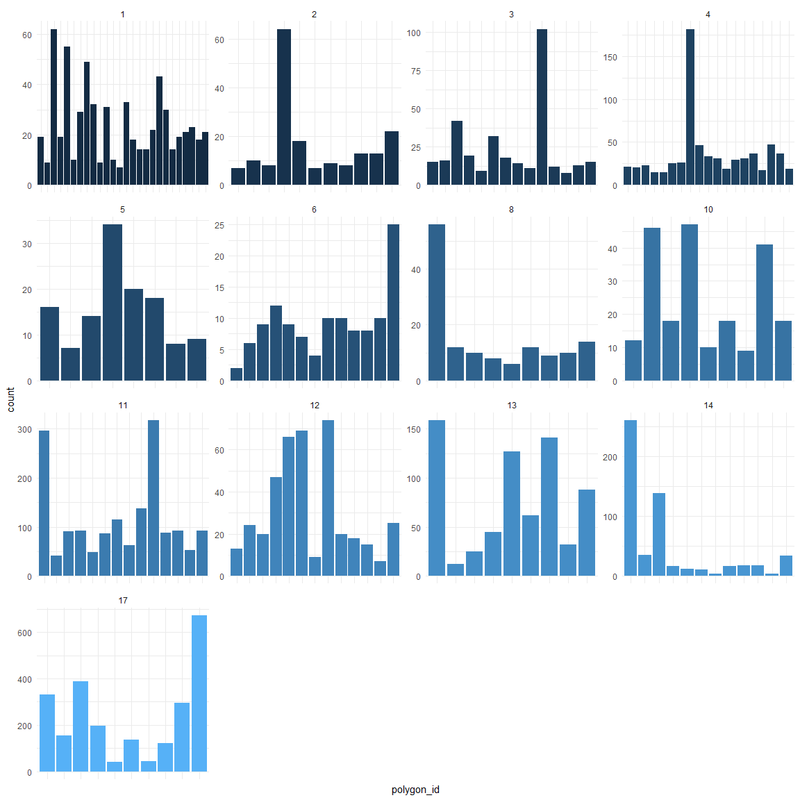
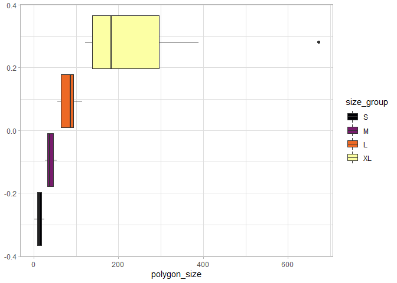
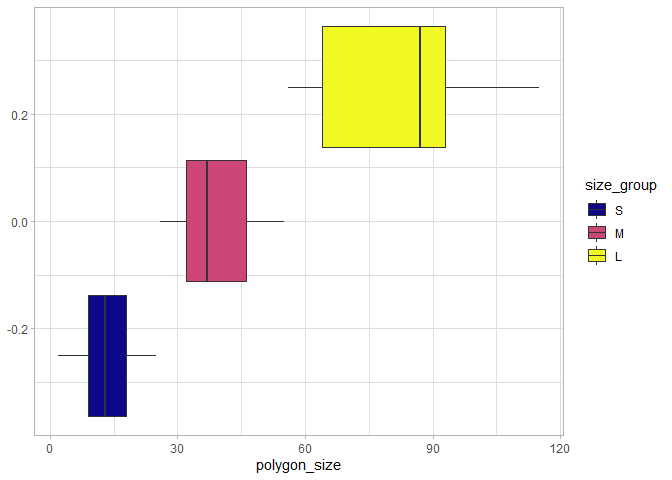
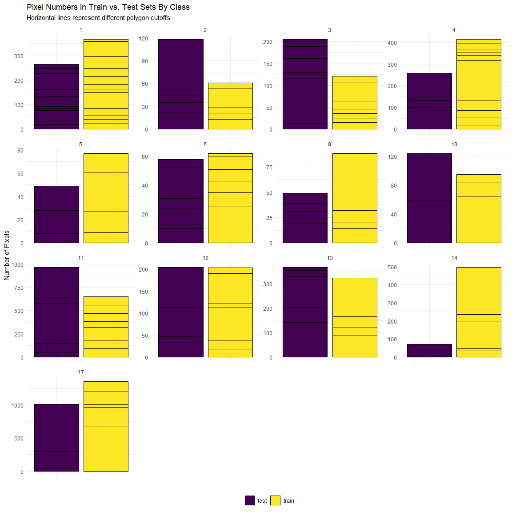

Split Training and Test
================

Read in dataframe with bands and lcz

``` r
all_dat <- readRDS(here("results", "hk_df.rds"))
```

Remove NAs and places with no LCZ class, make polygon\_ids numeric

``` r
polygons_only <- all_dat %>%
  filter(lcz != 0) %>%
  drop_na()
```

``` r
ggplot(polygons_only) +
  geom_bar(aes(x=polygon_id, fill=lcz)) +
  facet_wrap(~lcz, scales="free")+
  theme_minimal()+
  scale_x_discrete(labels=NULL)+
  theme(legend.position = "none")
```

<!-- -->

Create polygon sizes based on pixels. Trial and error with the polygon
size groupings until boxplots were more reasonable. Size XL is still
really wide but it’s about as good as it’ll get with keeping it general.

``` r
lcz_sizing <- polygons_only %>%
  group_by(polygon_id) %>%
  summarise(polygon_size =n()) %>%
  arrange(polygon_size)

polygon_size_breaks <- quantile(lcz_sizing$polygon_size, 
                                probs = seq(0,1,0.1))
sizes <- cut(lcz_sizing$polygon_size, 
             breaks=polygon_size_breaks, 
             include.lowest = T, 
             labels = c("S", "S", "S", "S",
                        "S","S", "M", "M",
                        "L", "XL"))
lcz_polygons_sized <- lcz_sizing %>%
  arrange(polygon_size) %>%
  mutate(size_group = sizes)

lcz_polygons_sized %>%
  ggplot()+
  geom_boxplot(aes(x=polygon_size, fill=size_group))+
  theme_light()+
  scale_fill_viridis_d(option="inferno")
```

<!-- -->

``` r
lcz_polygons_sized %>%
  filter(size_group !="XL") %>%
  ggplot()+
  geom_boxplot(aes(x=polygon_size, fill=size_group))+
  theme_light()+
  scale_fill_viridis_d(option="plasma")
```

<!-- -->

Which classes have the large polygons?

Not working.

Try just doing the sample and see how it looks: Using `sample_frac()` to
select the training polygons

``` r
poly_list <- polygons_only %>%
  group_by(lcz, polygon_id) %>%
  summarise(n_pixels = n())

train <- poly_list %>%
  group_by(lcz) %>%
  sample_frac(size=0.5)

test <- poly_list %>%
  anti_join(train, by="polygon_id")
```

Check if that worked

``` r
train_ids <- unique(train$polygon_id)
test_ids <- unique(test$polygon_id)
train_ids %in% test_ids
```

    ##  [1] FALSE FALSE FALSE FALSE FALSE FALSE FALSE FALSE FALSE FALSE FALSE FALSE
    ## [13] FALSE FALSE FALSE FALSE FALSE FALSE FALSE FALSE FALSE FALSE FALSE FALSE
    ## [25] FALSE FALSE FALSE FALSE FALSE FALSE FALSE FALSE FALSE FALSE FALSE FALSE
    ## [37] FALSE FALSE FALSE FALSE FALSE FALSE FALSE FALSE FALSE FALSE FALSE FALSE
    ## [49] FALSE FALSE FALSE FALSE FALSE FALSE FALSE FALSE FALSE FALSE FALSE FALSE
    ## [61] FALSE FALSE FALSE FALSE FALSE FALSE FALSE FALSE FALSE FALSE FALSE FALSE
    ## [73] FALSE FALSE FALSE FALSE FALSE FALSE FALSE FALSE FALSE FALSE

``` r
test_ids %in% train_ids
```

    ##  [1] FALSE FALSE FALSE FALSE FALSE FALSE FALSE FALSE FALSE FALSE FALSE FALSE
    ## [13] FALSE FALSE FALSE FALSE FALSE FALSE FALSE FALSE FALSE FALSE FALSE FALSE
    ## [25] FALSE FALSE FALSE FALSE FALSE FALSE FALSE FALSE FALSE FALSE FALSE FALSE
    ## [37] FALSE FALSE FALSE FALSE FALSE FALSE FALSE FALSE FALSE FALSE FALSE FALSE
    ## [49] FALSE FALSE FALSE FALSE FALSE FALSE FALSE FALSE FALSE FALSE FALSE FALSE
    ## [61] FALSE FALSE FALSE FALSE FALSE FALSE FALSE FALSE FALSE FALSE FALSE FALSE
    ## [73] FALSE FALSE FALSE FALSE FALSE FALSE FALSE FALSE FALSE FALSE FALSE FALSE
    ## [85] FALSE

``` r
polygons_only_split <- polygons_only %>%
  mutate(tt = ifelse(polygon_id %in% train_ids, "train", "test"))

ggplot(polygons_only_split) +
  geom_bar(aes(x=tt, fill=tt, group=polygon_id), color="black", position="stack") +
  facet_wrap(~lcz, scales="free")+
  theme_minimal()+
  theme(legend.title = element_blank(),
        legend.position = "bottom")+
  scale_x_discrete(labels=NULL)+
  scale_fill_viridis_d()+
  labs(title="Pixel Numbers in Train vs. Test Sets By Class",
       subtitle = "Horizontal lines represent different polygon cutoffs")+
  ylab("Number of Pixels")+
  xlab(" ")
```

<!-- -->

``` r
poly_list_tt <- poly_list %>%
  mutate(tt = ifelse(polygon_id %in% train_ids, "train", "test")) %>%
  group_by(lcz, tt) %>%
  summarise(total_n_pixels = sum(n_pixels),
            n_polygons = n())
```

Save data

``` r
saveRDS(poly_list_tt, here("results", "table_3_equivalent.rds"))
saveRDS(polygons_only_split, here("results", "hk_only_polys_with_traintest.rds"))
ggsave(here("results", "class_polygon_pixel_counts_plot.tiff"))
```

    ## Saving 7 x 5 in image
