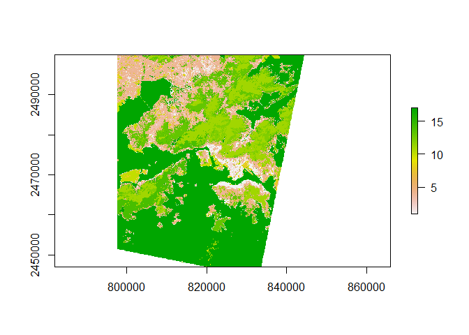
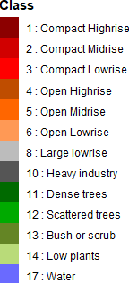
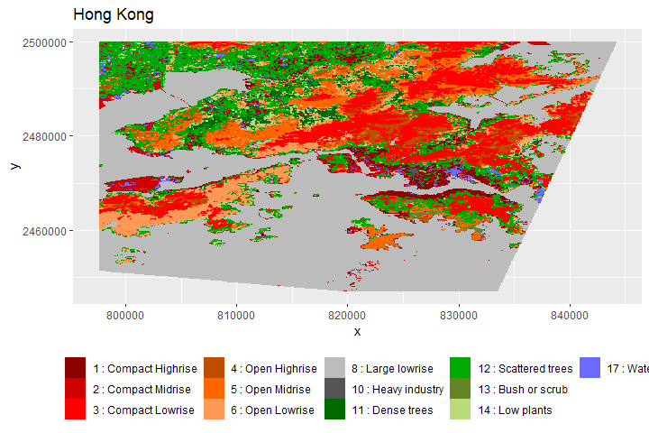
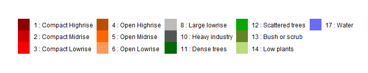

09\_make-complete-predicted-map
================
Ericka B. Smith

``` r
# rf <- readRDS(here("results", "winning_rf.rds"))
# all_scenes <- get_rasterstack()
```

``` r
predicted_map <- brick(here("results", "fully_predicted_hong_kong_map.tif"))
#predicted_map <- predict(all_scenes, model=rf, na.rm=T)
```

Make a plot:

``` r
plot(predicted_map)
```

<!-- -->

Save predictions as raster:

``` r
#writeRaster(predicted_map, here("results", "fully_predicted_hong_kong_map.tif"), overwrite=T)
```

Go into qGIS to set coloring as wanted?

Or just here.

``` r
colormap <- read.csv(here("data", "cmap_Qgis_WUDAPT_LCZ.txt"))
colormap <- colormap[-c(7,9,15,16),]
hex_colors <- colormap %>%
  mutate(hex= rgb(r,g,b,maxColorValue = 255)) %>%
  rename("Description" = "class_name",
  "Class" = "class_num") %>%
  mutate(Description = paste(Class, ":", Description),
         Class = factor(Class))
```

``` r
pred_map_pts<- rasterToPoints(predicted_map, spatial = TRUE)
# Then to a 'conventional' dataframe
pred_map_df  <- data.frame(pred_map_pts)
pred_map_df$fully_predicted_hong_kong_map %<>% factor()
pred_map_df <- pred_map_df %>%
  rename("Class" = "fully_predicted_hong_kong_map") %>%
  left_join(hex_colors, by = "Class") %>%
  mutate(Class = paste(Class, ":", Description ))
```

``` r
legend_plot <- ggplot(data=pred_map_df) +
 geom_raster(data = pred_map_df , aes(x = x, y = y, fill = Class)) + 
    ggtitle("Hong Kong")+
  scale_fill_manual(values = hex_colors$hex, labels=hex_colors$Description)+
  theme(legend.position = "right",
        legend.title = element_text(face = "bold"))
```

``` r
leg <- get_legend(legend_plot)
as_ggplot(leg)
```

<!-- -->

``` r
ggsave(here("results", "map_images/class_legend.pdf"))
```

    ## Saving 1.5 x 3.29 in image

``` r
legend_plot_h <- ggplot(data=pred_map_df) +
 geom_raster(data = pred_map_df , aes(x = x, y = y, fill = Class)) + 
    ggtitle("Hong Kong")+
  scale_fill_manual(values = hex_colors$hex, labels=hex_colors$Description)+
  theme(legend.position = "bottom",
        legend.title = element_blank())
legend_plot_h
```

<!-- -->

``` r
leg_h <- get_legend(legend_plot_h)
as_ggplot(leg_h)
```

<!-- -->

``` r
ggsave(here("results", "map_images/class_legend_horizontal.pdf"))
```

    ## Saving 7.5 x 1.5 in image
