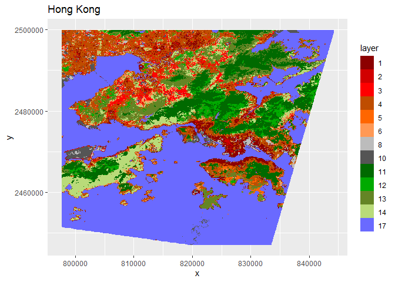

09\_make-complete-predicted-map
================
Ericka B. Smith

``` r
rf <- readRDS(here("results", "winning_rf.rds"))
all_scenes <- get_rasterstack()
```

``` r
predicted_map <- predict(all_scenes, model=rf, na.rm=T)
```

Make a plot:

``` r
plot(predicted_map)
```

<!-- -->

Save predictions as raster:

``` r
writeRaster(predicted_map, here("results", "fully_predicted_hong_kong_map.tif"), overwrite=T)
```

Go into qGIS to set coloring as wanted?

Or just here.

``` r
colormap <- read.csv(here("data", "cmap_Qgis_WUDAPT_LCZ.txt"))
colormap <- colormap[-c(7,9,15,16),]
hex_colors <- colormap %>%
  mutate(hex= rgb(r,g,b,maxColorValue = 255))
```

``` r
pred_map_pts<- rasterToPoints(predicted_map, spatial = TRUE)
# Then to a 'conventional' dataframe
pred_map_df  <- data.frame(pred_map_pts)
pred_map_df$layer %<>% factor()
ggplot() +
 geom_raster(data = pred_map_df , aes(x = x, y = y, fill = layer)) + 
    ggtitle("Hong Kong")+
  scale_fill_manual(values = hex_colors$hex, labels=hex_colors$class_num)
```

<!-- -->
