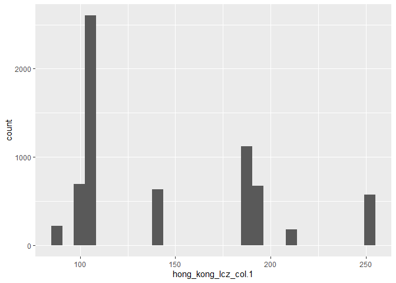
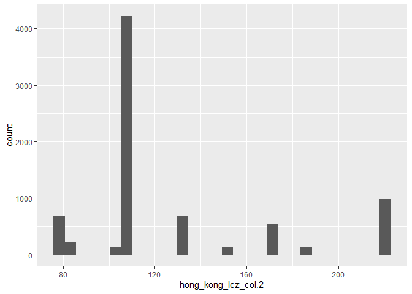

Getting the Landsat Data into R
================

libraries

``` r
library(randomForest)
```

    ## Warning: package 'randomForest' was built under R version 4.0.3

    ## randomForest 4.6-14

    ## Type rfNews() to see new features/changes/bug fixes.

``` r
library(raster)
```

    ## Loading required package: sp

``` r
library(rgdal)
```

    ## Warning: package 'rgdal' was built under R version 4.0.3

    ## rgdal: version: 1.5-19, (SVN revision 1092)
    ## Geospatial Data Abstraction Library extensions to R successfully loaded
    ## Loaded GDAL runtime: GDAL 3.0.4, released 2020/01/28
    ## Path to GDAL shared files: C:/Users/erick/Documents/R/win-library/4.0/rgdal/gdal
    ## GDAL binary built with GEOS: TRUE 
    ## Loaded PROJ runtime: Rel. 6.3.1, February 10th, 2020, [PJ_VERSION: 631]
    ## Path to PROJ shared files: C:/Users/erick/Documents/R/win-library/4.0/rgdal/proj
    ## Linking to sp version:1.4-4
    ## To mute warnings of possible GDAL/OSR exportToProj4() degradation,
    ## use options("rgdal_show_exportToProj4_warnings"="none") before loading rgdal.

``` r
library(here)
```

    ## Warning: package 'here' was built under R version 4.0.3

    ## here() starts at C:/Users/erick/Documents/MS_Project/masters-project-lcz-classification

``` r
library(tidyverse)
```

    ## -- Attaching packages ------------------------------------------------------------------------------------------------------------------- tidyverse 1.3.0 --

    ## v ggplot2 3.3.2     v purrr   0.3.4
    ## v tibble  3.0.1     v dplyr   0.8.5
    ## v tidyr   1.0.3     v stringr 1.4.0
    ## v readr   1.3.1     v forcats 0.5.0

    ## Warning: package 'ggplot2' was built under R version 4.0.3

    ## -- Conflicts ---------------------------------------------------------------------------------------------------------------------- tidyverse_conflicts() --
    ## x dplyr::combine()  masks randomForest::combine()
    ## x tidyr::extract()  masks raster::extract()
    ## x dplyr::filter()   masks stats::filter()
    ## x dplyr::lag()      masks stats::lag()
    ## x ggplot2::margin() masks randomForest::margin()
    ## x dplyr::select()   masks raster::select()

``` r
library(mapproj)
```

    ## Warning: package 'mapproj' was built under R version 4.0.3

    ## Loading required package: maps

    ## 
    ## Attaching package: 'maps'

    ## The following object is masked from 'package:purrr':
    ## 
    ##     map

``` r
#training <- readOGR('training_data.shp', layer='training_data')
train <- brick(here("data/hong_kong/lcz/", "hong_kong_lcz_col.tif"))
#le7 <- brick('LE70220491999322EDC01_stack.gtif')
le8 <- brick(here("data/hong_kong/landsat_8", "LC81220442015291LGN00/LC81220442015291LGN00_B1.tif"))
```

Definitely didn’t work and was just for testing (to see if I could go
through the tutorial code with my data) anyway, so scrap it.

Tomorrow: 1. Why did they give us the data as a tif instead of a shp
file? Is that advantageous? 2. If it’s not, how do I convert it to a
point shapefile? 3. Watch WUDAPT video

what is saga? - alternative to arc or qgis

*Updated filepaths, watched WUDAPT, trying stacking them into a
RasterStack*

``` r
all_data <- stack(le8, train)
```

Now what exactly is a RasterStack?

``` r
summary(all_data)
```

    ## Warning in .local(object, ...): summary is an estimate based on a sample of 1e+05 cells (35.8% of all cells)

    ##                layer hong_kong_lcz_col.1 hong_kong_lcz_col.2
    ## Min.        9.053158                   0                   0
    ## 1st Qu. 10317.156738                   0                   0
    ## Median  10894.180664                   0                   0
    ## 3rd Qu. 11287.256348                   0                   0
    ## Max.    42234.699219                 255                 219
    ## NA's    32939.000000                   0                   0
    ##         hong_kong_lcz_col.3 hong_kong_lcz_col.4
    ## Min.                      0                   0
    ## 1st Qu.                   0                   0
    ## Median                    0                   0
    ## 3rd Qu.                   0                   0
    ## Max.                    255                 255
    ## NA's                      0                   0

``` r
all_data_df <- as.data.frame(all_data, xy=TRUE)
```

But is that even what I’m looking for?

``` r
le8_df <- as.data.frame(le8, xy=TRUE)
train_df <- as.data.frame(train, xy=TRUE)
```

``` r
summary(all_data_df)
```

    ##        x                y               layer          hong_kong_lcz_col.1
    ##  Min.   :797658   Min.   :2447101   Min.   :    3.59   Min.   :  0.000    
    ##  1st Qu.:810833   1st Qu.:2460301   1st Qu.:10316.70   1st Qu.:  0.000    
    ##  Median :824008   Median :2473501   Median :10894.01   Median :  0.000    
    ##  Mean   :824008   Mean   :2473501   Mean   :11176.77   Mean   :  3.479    
    ##  3rd Qu.:837183   3rd Qu.:2486701   3rd Qu.:11287.58   3rd Qu.:  0.000    
    ##  Max.   :850358   Max.   :2499901   Max.   :43000.50   Max.   :255.000    
    ##                                     NA's   :33486                         
    ##  hong_kong_lcz_col.2 hong_kong_lcz_col.3 hong_kong_lcz_col.4
    ##  Min.   :  0.000     Min.   :  0.000     Min.   :  0.000    
    ##  1st Qu.:  0.000     1st Qu.:  0.000     1st Qu.:  0.000    
    ##  Median :  0.000     Median :  0.000     Median :  0.000    
    ##  Mean   :  3.487     Mean   :  3.158     Mean   :  8.076    
    ##  3rd Qu.:  0.000     3rd Qu.:  0.000     3rd Qu.:  0.000    
    ##  Max.   :219.000     Max.   :255.000     Max.   :255.000    
    ## 

``` r
summary(le8_df)
```

    ##        x                y               layer         
    ##  Min.   :797658   Min.   :2447101   Min.   :    3.59  
    ##  1st Qu.:810833   1st Qu.:2460301   1st Qu.:10316.70  
    ##  Median :824008   Median :2473501   Median :10894.01  
    ##  Mean   :824008   Mean   :2473501   Mean   :11176.77  
    ##  3rd Qu.:837183   3rd Qu.:2486701   3rd Qu.:11287.58  
    ##  Max.   :850358   Max.   :2499901   Max.   :43000.50  
    ##                                     NA's   :33486

``` r
summary(train_df)
```

    ##        x                y           hong_kong_lcz_col.1 hong_kong_lcz_col.2
    ##  Min.   :797658   Min.   :2447101   Min.   :  0.000     Min.   :  0.000    
    ##  1st Qu.:810833   1st Qu.:2460301   1st Qu.:  0.000     1st Qu.:  0.000    
    ##  Median :824008   Median :2473501   Median :  0.000     Median :  0.000    
    ##  Mean   :824008   Mean   :2473501   Mean   :  3.479     Mean   :  3.487    
    ##  3rd Qu.:837183   3rd Qu.:2486701   3rd Qu.:  0.000     3rd Qu.:  0.000    
    ##  Max.   :850358   Max.   :2499901   Max.   :255.000     Max.   :219.000    
    ##  hong_kong_lcz_col.3 hong_kong_lcz_col.4
    ##  Min.   :  0.000     Min.   :  0.000    
    ##  1st Qu.:  0.000     1st Qu.:  0.000    
    ##  Median :  0.000     Median :  0.000    
    ##  Mean   :  3.158     Mean   :  8.076    
    ##  3rd Qu.:  0.000     3rd Qu.:  0.000    
    ##  Max.   :255.000     Max.   :255.000

``` r
train_df %>%
  select(hong_kong_lcz_col.1) %>%
  filter(hong_kong_lcz_col.1 !=0) %>%
  ggplot()+
  geom_histogram(aes(x=hong_kong_lcz_col.1))
```

    ## `stat_bin()` using `bins = 30`. Pick better value with `binwidth`.

<!-- -->

``` r
train_df %>%
  select(hong_kong_lcz_col.2) %>%
  filter(hong_kong_lcz_col.2 !=0)%>%
  ggplot()+
  geom_histogram(aes(x=hong_kong_lcz_col.2))
```

    ## `stat_bin()` using `bins = 30`. Pick better value with `binwidth`.

<!-- -->

So the parts that aren’t zero in each column are actually different.

``` r
ggplot() +
    geom_raster(data = le8_df , aes(x = x, y = y, fill = layer)) +
    scale_fill_viridis_c() +
    coord_quickmap() +
  theme(legend.position = "none")
```

<!-- -->

it’s just band1? (bc it’s name ends in `_B1`)
