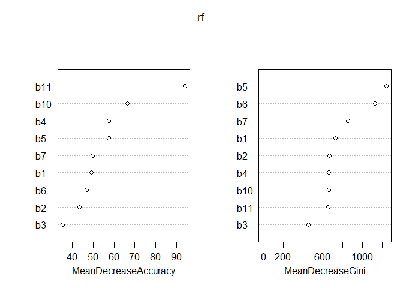
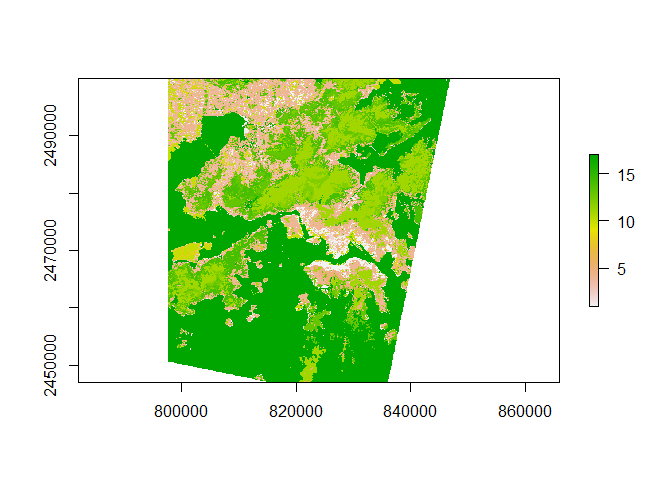

Getting the Hong Kong Data into R
================

libraries

``` r
library(randomForest)
```

    ## Warning: package 'randomForest' was built under R version 4.0.3

    ## randomForest 4.6-14

    ## Type rfNews() to see new features/changes/bug fixes.

``` r
library(raster)
```

    ## Loading required package: sp

``` r
library(rgdal)
```

    ## Warning: package 'rgdal' was built under R version 4.0.3

    ## rgdal: version: 1.5-19, (SVN revision 1092)
    ## Geospatial Data Abstraction Library extensions to R successfully loaded
    ## Loaded GDAL runtime: GDAL 3.0.4, released 2020/01/28
    ## Path to GDAL shared files: C:/Users/erick/Documents/R/win-library/4.0/rgdal/gdal
    ## GDAL binary built with GEOS: TRUE 
    ## Loaded PROJ runtime: Rel. 6.3.1, February 10th, 2020, [PJ_VERSION: 631]
    ## Path to PROJ shared files: C:/Users/erick/Documents/R/win-library/4.0/rgdal/proj
    ## Linking to sp version:1.4-4
    ## To mute warnings of possible GDAL/OSR exportToProj4() degradation,
    ## use options("rgdal_show_exportToProj4_warnings"="none") before loading rgdal.

``` r
library(here)
```

    ## Warning: package 'here' was built under R version 4.0.3

    ## here() starts at C:/Users/erick/Documents/MS_Project/masters-project-lcz-classification

``` r
library(tidyverse)
```

    ## -- Attaching packages ------------------------------------------------------------------------------------------------------------------- tidyverse 1.3.0 --

    ## v ggplot2 3.3.2     v purrr   0.3.4
    ## v tibble  3.0.1     v dplyr   0.8.5
    ## v tidyr   1.0.3     v stringr 1.4.0
    ## v readr   1.3.1     v forcats 0.5.0

    ## Warning: package 'ggplot2' was built under R version 4.0.3

    ## -- Conflicts ---------------------------------------------------------------------------------------------------------------------- tidyverse_conflicts() --
    ## x dplyr::combine()  masks randomForest::combine()
    ## x tidyr::extract()  masks raster::extract()
    ## x dplyr::filter()   masks stats::filter()
    ## x dplyr::lag()      masks stats::lag()
    ## x ggplot2::margin() masks randomForest::margin()
    ## x dplyr::select()   masks raster::select()

``` r
library(mapproj)
```

    ## Warning: package 'mapproj' was built under R version 4.0.3

    ## Loading required package: maps

    ## 
    ## Attaching package: 'maps'

    ## The following object is masked from 'package:purrr':
    ## 
    ##     map

``` r
#training <- readOGR('training_data.shp', layer='training_data')
train <- brick(here("data/hong_kong/lcz/", "hong_kong_lcz_gt.tif"))
#le7 <- brick('LE70220491999322EDC01_stack.gtif')
le8 <- brick(here("data/hong_kong/landsat_8", "LC81220442015291LGN00/LC81220442015291LGN00_B1.tif"))
```

``` r
all_data <- stack(le8, train)
```

``` r
summary(all_data)
```

    ## Warning in .local(object, ...): summary is an estimate based on a sample of 1e+05 cells (35.8% of all cells)

    ##              layer.1 layer.2
    ## Min.        9.053158       0
    ## 1st Qu. 10317.156738       0
    ## Median  10894.180664       0
    ## 3rd Qu. 11287.256348       0
    ## Max.    42234.699219      17
    ## NA's    32939.000000       0

Convert all into dataframes

``` r
all_data_df <- as.data.frame(all_data, xy=TRUE)
```

``` r
le8_df <- as.data.frame(le8, xy=TRUE)
train_df <- as.data.frame(train, xy=TRUE)
```

Compare three different dfs to see how `stack()` put things together

``` r
summary(all_data_df)
```

    ##        x                y              layer.1            layer.2       
    ##  Min.   :797658   Min.   :2447101   Min.   :    3.59   Min.   : 0.0000  
    ##  1st Qu.:810833   1st Qu.:2460301   1st Qu.:10316.70   1st Qu.: 0.0000  
    ##  Median :824008   Median :2473501   Median :10894.01   Median : 0.0000  
    ##  Mean   :824008   Mean   :2473501   Mean   :11176.77   Mean   : 0.3601  
    ##  3rd Qu.:837183   3rd Qu.:2486701   3rd Qu.:11287.58   3rd Qu.: 0.0000  
    ##  Max.   :850358   Max.   :2499901   Max.   :43000.50   Max.   :17.0000  
    ##                                     NA's   :33486

``` r
summary(le8_df)
```

    ##        x                y               layer         
    ##  Min.   :797658   Min.   :2447101   Min.   :    3.59  
    ##  1st Qu.:810833   1st Qu.:2460301   1st Qu.:10316.70  
    ##  Median :824008   Median :2473501   Median :10894.01  
    ##  Mean   :824008   Mean   :2473501   Mean   :11176.77  
    ##  3rd Qu.:837183   3rd Qu.:2486701   3rd Qu.:11287.58  
    ##  Max.   :850358   Max.   :2499901   Max.   :43000.50  
    ##                                     NA's   :33486

``` r
summary(train_df)
```

    ##        x                y               layer        
    ##  Min.   :797658   Min.   :2447101   Min.   : 0.0000  
    ##  1st Qu.:810833   1st Qu.:2460301   1st Qu.: 0.0000  
    ##  Median :824008   Median :2473501   Median : 0.0000  
    ##  Mean   :824008   Mean   :2473501   Mean   : 0.3601  
    ##  3rd Qu.:837183   3rd Qu.:2486701   3rd Qu.: 0.0000  
    ##  Max.   :850358   Max.   :2499901   Max.   :17.0000

``` r
train_df %>%
  filter(layer !=0) %>%
  ggplot()+
  geom_histogram(aes(x=layer))
```

    ## `stat_bin()` using `bins = 30`. Pick better value with `binwidth`.

<!-- -->

``` r
train_df %>%
  filter(layer !=0) %>%
  mutate(lcz = factor(layer)) %>%
  summary()
```

    ##        x                y               layer            lcz      
    ##  Min.   :800458   Min.   :2456001   Min.   : 1.00   17     :2603  
    ##  1st Qu.:816458   1st Qu.:2469001   1st Qu.:10.00   11     :1616  
    ##  Median :824458   Median :2476501   Median :12.00   14     : 985  
    ##  Mean   :824091   Mean   :2477041   Mean   :11.37   13     : 691  
    ##  3rd Qu.:831658   3rd Qu.:2485001   3rd Qu.:17.00   4      : 673  
    ##  Max.   :846458   Max.   :2497201   Max.   :17.00   1      : 631  
    ##                                                     (Other):1647

``` r
ggplot() +
    geom_raster(data = le8_df , aes(x = x, y = y, fill = layer)) +
    scale_fill_viridis_c() +
    coord_quickmap() +
  theme(legend.position = "none")
```

<!-- -->

## 1/14/21

#### Is GT what I think it is?

I think that I’ve figured out how to match up my pixels with theirs, but
some of the numbers seem off so I’m going to compare them here:

``` r
table_3 <- data.frame(
  lcz =  c(1:17),
  training = c(318, 112, 195, 383, 76, 64, 0, 86, 0, 109, 832, 207, 379, 332, 0, 0, 1282),
  test = c(313, 67, 131, 290, 50, 56, 0, 51, 0, 110, 784, 200, 312, 236, 0, 0, 1054)
)
table_3 <- table_3 %>%
  mutate(total_pixels = training+test)
```

``` r
summary(factor(train_df$layer))
```

    ##      0      1      2      3      4      5      6      8     10     11     12 
    ## 270466    631    179    326    673    126    120    137    219   1616    540 
    ##     13     14     17 
    ##    691    985   2603

``` r
table_3$total_pixels
```

    ##  [1]  631  179  326  673  126  120    0  137    0  219 1616  407  691  568    0
    ## [16]    0 2336

So they’re all the same in the table from the paper as in my imported
data except for 12, 13, 14, and 17, each of which has more in my
imported data than in the table. Did they clip the data more closely to
Hong Kong’s limits?

12, 13, 14, 17 are scattered trees, bush/scrub, low plants, and water,
respectively. So it would make sense if it’s just a difference in outer
limit. Not sure how to figure out exactly how they clipped the data, but
I’m going to put that off for rn.

``` r
rm(all_data, all_data_df, le8, le8_df, train, train_df)
```

#### Bands

They use bands 1-7, 10, and 11.

I’m going to just pick a day and get those bands in.

``` r
lcz_train <- brick(here("data/hong_kong/lcz/", "hong_kong_lcz_gt.tif"))
b1 <- brick(here("data/hong_kong/landsat_8", "LC81220442015291LGN00/LC81220442015291LGN00_B1.tif"))
b2 <- brick(here("data/hong_kong/landsat_8", "LC81220442015291LGN00/LC81220442015291LGN00_B2.tif"))
b3 <- brick(here("data/hong_kong/landsat_8", "LC81220442015291LGN00/LC81220442015291LGN00_B3.tif"))
b4 <- brick(here("data/hong_kong/landsat_8", "LC81220442015291LGN00/LC81220442015291LGN00_B4.tif"))
b5 <- brick(here("data/hong_kong/landsat_8", "LC81220442015291LGN00/LC81220442015291LGN00_B5.tif"))
b6 <- brick(here("data/hong_kong/landsat_8", "LC81220442015291LGN00/LC81220442015291LGN00_B6.tif"))
b7 <- brick(here("data/hong_kong/landsat_8", "LC81220442015291LGN00/LC81220442015291LGN00_B7.tif"))
b10 <- brick(here("data/hong_kong/landsat_8", "LC81220442015291LGN00/LC81220442015291LGN00_B10.tif"))
b11 <- brick(here("data/hong_kong/landsat_8", "LC81220442015291LGN00/LC81220442015291LGN00_B11.tif"))
```

Put them all together

``` r
lcz_and_bands <- stack(lcz_train, b1, b2, b3, b4, b5, b6, b7, b10, b11)
```

change to df and fix column names

``` r
lcz_and_bands_df <- as.data.frame(lcz_and_bands)
names(lcz_and_bands_df) <- c("lcz", "b1", "b2", "b3", "b4", "b5", "b6", "b7", "b10", "b11")
```

Does it look right?

``` r
summary(lcz_and_bands_df)
```

    ##       lcz                b1                 b2                 b3          
    ##  Min.   : 0.0000   Min.   :    3.59   Min.   :    3.32   Min.   :    2.89  
    ##  1st Qu.: 0.0000   1st Qu.:10316.70   1st Qu.: 9375.81   1st Qu.: 8393.54  
    ##  Median : 0.0000   Median :10894.01   Median :10126.66   Median : 9086.35  
    ##  Mean   : 0.3601   Mean   :11176.77   Mean   :10397.99   Mean   : 9430.29  
    ##  3rd Qu.: 0.0000   3rd Qu.:11287.58   3rd Qu.:10575.67   3rd Qu.: 9579.53  
    ##  Max.   :17.0000   Max.   :43000.50   Max.   :45236.32   Max.   :45913.02  
    ##                    NA's   :33486      NA's   :33478      NA's   :33488     
    ##        b4                 b5                 b6                 b7          
    ##  Min.   :    2.38   Min.   :    2.07   Min.   :    1.82   Min.   :    1.76  
    ##  1st Qu.: 7288.08   1st Qu.: 6779.46   1st Qu.: 5878.64   1st Qu.: 5623.63  
    ##  Median : 7695.82   Median :11310.33   Median : 8656.14   Median : 6641.05  
    ##  Mean   : 8377.39   Mean   :11380.80   Mean   : 8702.68   Mean   : 7240.12  
    ##  3rd Qu.: 8495.29   3rd Qu.:15157.05   3rd Qu.:10625.91   3rd Qu.: 7965.55  
    ##  Max.   :48744.93   Max.   :52430.51   Max.   :35916.04   Max.   :29650.14  
    ##  NA's   :33485      NA's   :33478      NA's   :33507      NA's   :33497     
    ##       b10               b11          
    ##  Min.   :    8.5   Min.   :    7.73  
    ##  1st Qu.:25799.3   1st Qu.:23499.36  
    ##  Median :26485.9   Median :24166.71  
    ##  Mean   :26401.3   Mean   :24017.33  
    ##  3rd Qu.:27138.0   3rd Qu.:24664.50  
    ##  Max.   :34666.9   Max.   :30157.96  
    ##  NA's   :51498     NA's   :51718

Yes. Let’s trim it down now and make lcz a factor

``` r
rf_training_df <- lcz_and_bands_df %>%
  filter(lcz != 0) %>%
  mutate(lcz = factor(lcz))

summary(rf_training_df)
```

    ##       lcz             b1              b2              b3              b4       
    ##  17     :2603   Min.   : 9524   Min.   : 8556   Min.   : 7547   Min.   : 6635  
    ##  11     :1616   1st Qu.:10088   1st Qu.: 9128   1st Qu.: 8201   1st Qu.: 7152  
    ##  14     : 985   Median :10743   Median : 9916   Median : 9026   Median : 7895  
    ##  13     : 691   Mean   :11103   Mean   :10303   Mean   : 9426   Mean   : 8571  
    ##  4      : 673   3rd Qu.:11339   3rd Qu.:10635   3rd Qu.: 9721   3rd Qu.: 8911  
    ##  1      : 631   Max.   :43001   Max.   :45236   Max.   :45913   Max.   :48745  
    ##  (Other):1647                                                                  
    ##        b5              b6              b7             b10          
    ##  Min.   : 6302   Min.   : 5495   Min.   : 5297   Min.   :   93.54  
    ##  1st Qu.: 7299   1st Qu.: 6253   1st Qu.: 5922   1st Qu.:25761.66  
    ##  Median :13389   Median : 9498   Median : 7043   Median :26447.42  
    ##  Mean   :12633   Mean   : 9498   Mean   : 7692   Mean   :26439.34  
    ##  3rd Qu.:15591   3rd Qu.:11118   3rd Qu.: 8607   3rd Qu.:27236.31  
    ##  Max.   :52431   Max.   :35916   Max.   :28235   Max.   :30474.40  
    ##                                                  NA's   :402       
    ##       b11       
    ##  Min.   : 1592  
    ##  1st Qu.:23488  
    ##  Median :24091  
    ##  Mean   :24016  
    ##  3rd Qu.:24644  
    ##  Max.   :27246  
    ##  NA's   :409

What are bands 10 and 11 and why do they have so many NAs? They’re the
“30m resolution thermal bands interpolated from 100 m resolution data
collected from Thermal Infrared Sensor (TIRS)” I’m assuming I need to
cut them out? Going to try. Maybe it’ll make the pixel numbers match
their table

``` r
rf_training_df_nona <- rf_training_df %>%
  drop_na()

summary(rf_training_df_nona)
```

    ##       lcz             b1              b2              b3              b4       
    ##  17     :2603   Min.   : 9524   Min.   : 8556   Min.   : 7547   Min.   : 6635  
    ##  11     :1616   1st Qu.:10092   1st Qu.: 9136   1st Qu.: 8200   1st Qu.: 7152  
    ##  14     : 709   Median :10868   Median :10058   Median : 9128   Median : 7945  
    ##  13     : 691   Mean   :11149   Mean   :10357   Mean   : 9480   Mean   : 8633  
    ##  4      : 673   3rd Qu.:11356   3rd Qu.:10653   3rd Qu.: 9752   3rd Qu.: 8978  
    ##  1      : 631   Max.   :43001   Max.   :45236   Max.   :45913   Max.   :48745  
    ##  (Other):1514                                                                  
    ##        b5              b6              b7             b10       
    ##  Min.   : 6302   Min.   : 5495   Min.   : 5297   Min.   :10874  
    ##  1st Qu.: 7245   1st Qu.: 6208   1st Qu.: 5891   1st Qu.:25764  
    ##  Median :13236   Median : 9458   Median : 7046   Median :26448  
    ##  Mean   :12528   Mean   : 9486   Mean   : 7723   Mean   :26458  
    ##  3rd Qu.:15564   3rd Qu.:11229   3rd Qu.: 8690   3rd Qu.:27238  
    ##  Max.   :52431   Max.   :35916   Max.   :28235   Max.   :30474  
    ##                                                                 
    ##       b11       
    ##  Min.   : 1592  
    ##  1st Qu.:23488  
    ##  Median :24091  
    ##  Mean   :24016  
    ##  3rd Qu.:24644  
    ##  Max.   :27246  
    ## 

Let’s compare with table 3

``` r
summary(rf_training_df_nona$lcz)
```

    ##    1    2    3    4    5    6    8   10   11   12   13   14   17 
    ##  631  179  326  673  126  120  137  219 1616  407  691  709 2603

``` r
table_3$total_pixels
```

    ##  [1]  631  179  326  673  126  120    0  137    0  219 1616  407  691  568    0
    ## [16]    0 2336

Well now only 14 (low plants) and 17 (water) have too many, which is
something. When I look at it in QGIS there’s one 17 classed polygon that
goes outside the limits, but I don’t see any class 14. This is too much
of a sidetrack.

#### Fit a random forest (?\!)

``` r
rf <- randomForest(lcz ~ b1 + b2 + b3 + b4 + b5 + b6 + b7 + b10 +b11, data=rf_training_df_nona, importance=TRUE)
print(rf)
```

    ## 
    ## Call:
    ##  randomForest(formula = lcz ~ b1 + b2 + b3 + b4 + b5 + b6 + b7 +      b10 + b11, data = rf_training_df_nona, importance = TRUE) 
    ##                Type of random forest: classification
    ##                      Number of trees: 500
    ## No. of variables tried at each split: 3
    ## 
    ##         OOB estimate of  error rate: 14.19%
    ## Confusion matrix:
    ##      1  2   3   4  5  6  8 10   11  12  13  14   17 class.error
    ## 1  460 33   1  99  2  1 11 11    0   1   3   0    9 0.270998415
    ## 2   35 97  19  16  0  1  1 10    0   0   0   0    0 0.458100559
    ## 3    1  2 277  24  0  9  3  8    0   1   0   1    0 0.150306748
    ## 4   50  8  22 554  4  8  2  4   14   3   1   3    0 0.176820208
    ## 5   10  0   1  20 53  0  0  0    1   4  27   0   10 0.579365079
    ## 6    4  0  10  18  0 63  0  1    0   2   7  14    1 0.475000000
    ## 8   15  5   5  13  0  6 57 31    0   0   2   2    1 0.583941606
    ## 10  50  9  21   9  0  3 28 97    0   0   0   0    2 0.557077626
    ## 11   0  0   0  10  1  0  0  0 1569  11   1  24    0 0.029084158
    ## 12   4  0   1  11  4 11  0  0   36 273  34  30    3 0.329238329
    ## 13   5  0   3   6 13  5  0  5    6  16 568  56    8 0.178002894
    ## 14   0  0   2  11  0 13  0  0   30  12  52 589    0 0.169252468
    ## 17   2  0   0   0 13  0  0  0    0   0   5   0 2583 0.007683442

``` r
importance(rf)
```

    ##            1        2        3        4        5        6        8       10
    ## b1  40.09335 38.02507 37.82508 47.79926 20.92446 26.07469 45.74930 38.57722
    ## b2  30.94547 31.09409 27.60405 43.50709 18.43614 25.04184 29.21609 37.96063
    ## b3  20.35017 23.27455 21.97967 31.22534 10.79900 14.90175 12.88295 30.88994
    ## b4  37.57532 43.88529 27.41940 36.10982 21.16627 19.52904 13.53355 19.71854
    ## b5  72.43173 54.34894 72.36072 69.54009 35.53267 49.58379 12.95130 10.11336
    ## b6  29.54324 27.64825 38.90442 39.49679 12.70701 31.84336 14.14563 18.69859
    ## b7  37.30932 26.15784 76.88086 34.77337 15.41715 32.59064 25.32613  7.68258
    ## b10 24.94156 41.23832 27.99252 34.42480 24.75371 16.67932 34.54344 43.61126
    ## b11 26.84090 50.84016 79.85496 31.43585 46.51242 24.28714 22.38547 25.06587
    ##           11       12       13       14       17 MeanDecreaseAccuracy
    ## b1  18.60070 59.25949 55.96400 45.56543 15.75141             49.08560
    ## b2  27.31621 32.89441 39.62186 36.35406 15.88501             43.39812
    ## b3  21.39165 14.04539 28.33470 24.57121 12.99759             35.18313
    ## b4  44.63113 22.35647 29.85910 32.99580 13.41404             57.52537
    ## b5  34.13865 65.71005 54.74800 44.57446 35.96993             57.39374
    ## b6  25.40567 40.07334 47.77900 52.45750 35.93964             46.93318
    ## b7  28.59414 24.41225 27.79250 32.75676 30.88549             49.61531
    ## b10 37.45826 36.02019 53.45090 40.48594 17.21090             66.38039
    ## b11 41.03953 36.88281 67.57552 29.47473 16.84217             94.20904
    ##     MeanDecreaseGini
    ## b1          730.0896
    ## b2          669.1513
    ## b3          455.9911
    ## b4          658.9392
    ## b5         1246.0888
    ## b6         1129.6320
    ## b7          854.4442
    ## b10         658.1835
    ## b11         656.6157

``` r
varImpPlot(rf)
```

<!-- -->

Bring back just the landsat data

``` r
only_bands <- stack(b1, b2, b3, b4, b5, b6, b7, b10, b11)
names(only_bands) <- c('b1', 'b2', 'b3', 'b4', 'b5', 'b6', 'b7', 'b10', 'b11')
```

Do the actual prediction:

``` r
bands_lcz_predicted <- predict(only_bands, model=rf, na.rm=T)
```

**I got a bunch of errors when I tried to make the prediction with
only\_bands in a data frame (rather than a RasterStack) and that doesn’t
make sense to me since the random forest was created with a data
frame.**

Make a plot:

``` r
plot(bands_lcz_predicted)
```

<!-- -->

Save this file to look at in QGIS

``` r
writeRaster(bands_lcz_predicted, here("results", "first_successful_prediction_01142021.tif"), overwrite=T)
```

    ## Warning in .gd_SetProject(object, ...): NOT UPDATED FOR PROJ >= 6
