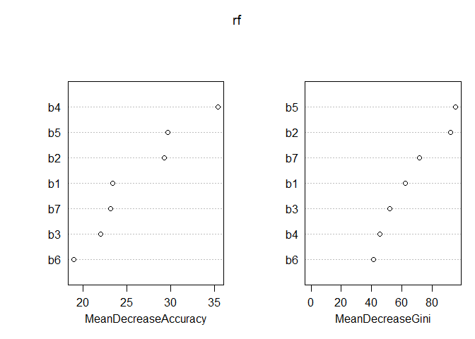
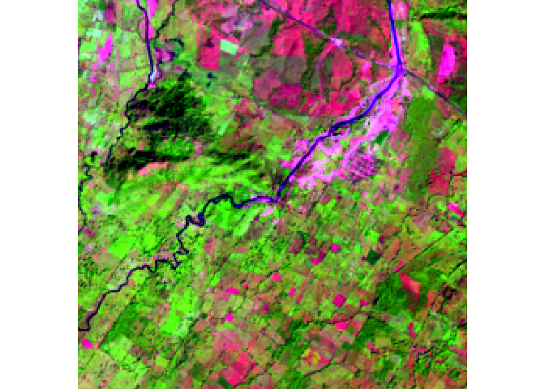

Walk through of Chapter 5: Classification Resource
================

Following along with [Chapter 5:
Classification](http://ceholden.github.io/open-geo-tutorial/R/chapter_5_classification.html)
from [Open Source Geoprocessing Tutorial by Chris
Holden](https://github.com/ceholden/open-geo-tutorial)

``` r
library(randomForest)
```

    ## randomForest 4.6-14

    ## Type rfNews() to see new features/changes/bug fixes.

``` r
library(raster)
```

    ## Loading required package: sp

``` r
library(rgdal)
```

    ## rgdal: version: 1.5-12, (SVN revision 1018)
    ## Geospatial Data Abstraction Library extensions to R successfully loaded
    ## Loaded GDAL runtime: GDAL 3.0.4, released 2020/01/28
    ## Path to GDAL shared files: /usr/share/gdal
    ## GDAL binary built with GEOS: TRUE 
    ## Loaded PROJ runtime: Rel. 6.2.0, September 1st, 2019, [PJ_VERSION: 620]
    ## Path to PROJ shared files: /usr/share/proj
    ## Linking to sp version:1.4-4
    ## To mute warnings of possible GDAL/OSR exportToProj4() degradation,
    ## use options("rgdal_show_exportToProj4_warnings"="none") before loading rgdal.

``` r
if (file.exists('training_data.shp') == F) {
    download.file(url = 'https://raw.githubusercontent.com/ceholden/open-geo-tutorial/master/example/training_data.zip', 
                  destfile = 'training_data.zip', method = 'curl')
    unzip('training_data.zip')
}
training <- readOGR('training_data.shp', layer='training_data')
```

    ## OGR data source with driver: ESRI Shapefile 
    ## Source: "/home/smither8/masters-project-lcz-classification/doc/training_data.shp", layer: "training_data"
    ## with 30 features
    ## It has 2 fields
    ## Integer64 fields read as strings:  id

``` r
if (file.exists('LE70220491999322EDC01_stack.gtif') == F) {
    download.file(url='https://raw.githubusercontent.com/ceholden/open-geo-tutorial/master/example/LE70220491999322EDC01_stack.gtif',
                  destfile='LE70220491999322EDC01_stack.gtif', method='curl')
}
le7 <- brick('LE70220491999322EDC01_stack.gtif')
```

  - Had to use comment by mysteRious on [stack
    overflow](https://stackoverflow.com/questions/35666638/cant-access-user-library-in-r-non-zero-exit-status-warning)
    to get `rgdal` to install.
  - `brick()` [“Create a RasterBrick Object: A RasterBrick is a
    multi-layer raster object. They are typically created from a
    multi-band file; but they can also exist entirely in
    memory.”](https://www.rdocumentation.org/packages/raster/versions/1.7-6/topics/brick)

Extract the reflectance data covering the training data labels.

``` r
roi_data <- extract(le7, training, df=TRUE)
```

  - `extract()` [“Extract values from a Raster\* object at the locations
    of spatial vector data. There are methods for points, lines, and
    polygons (classes from `sp` or `sf`), for a matrix or data.frame of
    points. You can also use cell numbers and Extent (rectangle) objects
    to extract
    values”](https://www.rdocumentation.org/packages/raster/versions/3.4-5/topics/extract)

Mask out clouds or cloud shadows:

``` r
roi_data[which(roi_data$Band.8 > 1)] <- NA
```

Also need to attach the labels to this `DataFrame`:

``` r
roi_data$lc <- as.factor(training$id[roi_data$ID])
roi_data$desc <- as.factor(training$class[roi_data$ID])
```

### Train RandomForest

Let’s use the extracted training data to train the RandomForest
algorithm:

``` r
# Set seed value for RNG for reproducibility
set.seed(1234567890)
colnames(roi_data)
```

    ##  [1] "ID"                 "band.1.reflectance" "band.2.reflectance"
    ##  [4] "band.3.reflectance" "band.4.reflectance" "band.5.reflectance"
    ##  [7] "band.7.reflectance" "band.6.temperature" "Band.8"            
    ## [10] "lc"                 "desc"

``` r
# Shorten column names
colnames(roi_data) <- c('ID', 'b1', 'b2', 'b3', 'b4', 'b5', 'b7', 'b6', 'fmask', 'lc', 'desc')
rf <- randomForest(lc ~ b1 + b2 + b3 + b4 + b5 + b7 + b6, data=roi_data, importance=TRUE)
print(rf)
```

    ## 
    ## Call:
    ##  randomForest(formula = lc ~ b1 + b2 + b3 + b4 + b5 + b7 + b6,      data = roi_data, importance = TRUE) 
    ##                Type of random forest: classification
    ##                      Number of trees: 500
    ## No. of variables tried at each split: 2
    ## 
    ##         OOB estimate of  error rate: 1.95%
    ## Confusion matrix:
    ##     1  2   3   4  5 class.error
    ## 1 381  0   2   0  0 0.005221932
    ## 2   0 16   0   0  0 0.000000000
    ## 3   2  0 143   0  0 0.013793103
    ## 4   0  0   0 101  5 0.047169811
    ## 5   0  0   0   5 63 0.073529412

One of the useful metrics provided by RandomForest is the `importance`
metric. This metric can be computed in two ways – the mean decrease in
accuracy as each variable is removed or the [Gini
impurity](http://en.wikipedia.org/wiki/Decision_tree_learning#Gini_impurity)
metric. Either way it gives an idea of what features (Landsat bands)
were important in assigning the classification
    labels.

``` r
importance(rf)
```

    ##            1        2        3        4        5 MeanDecreaseAccuracy
    ## b1 10.390680 14.82334 17.08463 13.74619 22.28624             23.34623
    ## b2 21.916419 18.46548 28.40580 16.54167 21.74883             29.22175
    ## b3 10.854574 15.06623 12.65672 11.70256 25.12974             21.99606
    ## b4 10.562816 18.04452 24.94280 12.91868 36.37061             35.40825
    ## b5 10.685140 23.93207 27.11298 26.19261 23.02884             29.64387
    ## b7  6.731642 11.49279 18.04329 20.37508 22.90925             23.14186
    ## b6  4.491135  9.30763 14.00406 17.68621 19.42750             18.88791
    ##    MeanDecreaseGini
    ## b1         62.20267
    ## b2         92.45899
    ## b3         52.25425
    ## b4         45.46855
    ## b5         95.68353
    ## b7         71.84533
    ## b6         41.33537

See `?importance` for more information:

> Here are the definitions of the variable importance measures. The
> first measure is computed from permuting OOB data: For each tree, the
> prediction error on the out-of-bag portion of the data is recorded
> (error rate for classification, MSE for regression). Then the same is
> done after permuting each predictor variable. The difference between
> the two are then averaged over all trees, and normalized by the
> standard deviation of the differences. If the standard deviation of
> the differences is equal to 0 for a variable, the division is not done
> (but the average is almost always equal to 0 in that case). The second
> measure is the total decrease in node impurities from splitting on the
> variable, averaged over all trees. For classification, the node
> impurity is measured by the Gini index. For regression, it is measured
> by residual sum of
squares.

``` r
varImpPlot(rf)
```

<!-- -->

Sticking with similarities for right now, we see that the thermal band
(band 6) is not very useful for our classification. This should agree
with our expectations because the brightness temperature does not vary
greatly across the land covers we selected, although it can prove useful
when comparing irregated agriculture against natural grasslands or urban
heat island impacted development against more suburban development.

I am more inclined to believe the importance as measured by the mean
decrease in the Gini impurity metric because it ranks the two short-wave
infrared (SWIR) bands more highly than the near-infrared (NIR) or the
visible. Because it is impacted by leaf moisture, the SWIR bands greatly
help the distinction between forests and grasslands. One thing to note
is that because many of the bands are intrinsically or physically
correlated with one another, our dataset is highly collinear. This
multicollinearity means that a small subset of the bands provide truely
unique information and our importance metric will be unstable depending
on the random chance of one band being favored over another highly
correlated band.

### Classify

We can proceed to classify the entire raster now that our algorithm is
trained. To make sure our classifier knows what raster bands to choose
from, we’ll begin by renaming the layers within our Landsat 7 image.

``` r
le7_class <- le7
names(le7_class) <- c('b1', 'b2', 'b3', 'b4', 'b5', 'b7', 'b6', 'fmask')
# Predict!
le7_pred <- predict(le7_class, model=rf, na.rm=T)
```

### Map

Let’s make a map\!

``` r
# Create color map
colors <- c(rgb(0, 150, 0, maxColorValue=255),  # Forest
            rgb(0, 0, 255, maxColorValue=255),  # Water
            rgb(0, 255, 0, maxColorValue=255),  # Herbaceous
            rgb(160, 82, 45, maxColorValue=255),  # Barren
            rgb(255, 0, 0, maxColorValue=255))  # Urban
plotRGB(le7, r=5, g=4, b=3, stretch="lin")
```

<!-- -->

``` r
plot(le7_pred, col=colors)
```

<!-- -->
