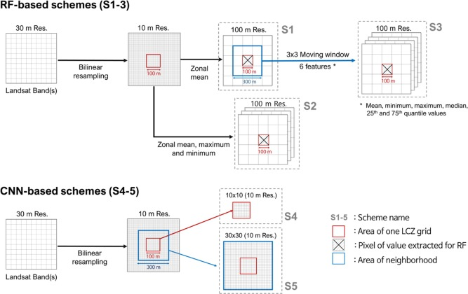

```{r setup, include=FALSE}
knitr::opts_chunk$set(echo = TRUE)
```

## Tuia et al 2017 (Introduces competition) : 
[DOI](https://doi.org/10.1109/MGRS.2016.2645380)

* "classification is to be performe at a coarse resolution (100m x 100m resolution grids)"
* Organizing committee has provided
  * Landsat 8 - resampled to the target grid
  * Sentinel 2 - resampled to the target grid
  * OpenStreetMap - both vector and resampled 5-m grids
  * Can also direct download at source for higher resolution (but I couldn't get the link to work, haven't tried them all though)
  
## Yokoya et al 2017 (outcome of competition) : 

[DOI](https://doi.org/10.1109/JSTARS.2018.2799698)

* Training Cities (5 - Berlin, Hong Kong, Paris, Rome, Sao Paulo)
  * LCZ reference data (described same as above)
  * satellite layers (described same as above)
  * GIS layers from OSM - "provided as vector layers and partly also rasterized on a 5-m grid"
  * Preprocessing conducted in SAGA GIS
* Test Cities (4 - Amsterdam, Chicago, Madrid, Xi'an)
  * Same but no LCZ reference data

### Landsat Images

1. Several scenes per city (from 2 to 5 different dates) were downloaded from the USGS EarthExplorer portal
2. The visible, short-wave, and long-wave infrared bands [therefore excluding the atmospheric band (9) and the panchromatic band (8)] were resampled to the 100-m target grid using an area weighted average.

### Sentinel-2 Images

1. Downloaded Sentinel-2 data via the Amazon Web Services Archive 2. resampled, to 100-m resolution, nine multispectral bands including the visible, vegetation red edge, and short-wave infrared wavelengths and excluding the atmospheric bands [1, 9, and 10, see Fig. 2(c)]. 
3. One date, corresponding to between 1 and 5 Sentinel-2 tiles, was selected for each site.

Note: Additionally, direct links to the original data (10–20 m) were provided to encourage use of the additional spatial details included in the full resolution imagery

### OSM Layers

Vector format with linked attribute data.Has information on roads, railways, points of interest, natural features, water areas, land use, and buildings, among others. 

1. downloaded in shapefile format from the [Geofabrik portal](http://www.geofabrik.de)
2. For some cities, several administrative areas had to be merged.
3. Building footprints (polygon), land use (polygon), water areas (polygon), and road network (line) were provided as vector data.
. Additionally, building footprints, land use, and water layers were rasterized to a 5-m grid, which was superimposable with the satellite images

### LCZ Ground Truth

1. Initially extracted from the WUDAPT database and thoroughly revised to ensure the highest possible correctness.
2. The training data were provided as raster layers at 100-m resolution, superimposable to the satellite images.

Note: 
* The ground truth for the test set remained (and still remains) undisclosed and was used for evaluation of the results in DASE.
* classes in the ground truth were severely imbalanced (low of 323 to high of 17716 w/ average of 4814 and median of 2819)
  * additional challenge for the classification algorithms, some of which (e.g., support vector machines) are known to be affected by imbalance issues.
  * test set was too. 
* Ratio between the numbers of training and test samples of each class ranged from 0.3 to 6.8 (average=1.9,median=1.2)


## Yoo et al 2019 (the paper we're working from)

### Satellite Input Data

1. Get two Landsat 8 images of different seasons (approximate winter and approximate summer) for each city were downloaded from USGS Earth Explorer. Acquisition dates in Table 2. 

Rome: January 11, 2017 & August 23, 2017
Hong Kong: February 12, 2018 &  October 23, 2017
Madrid: January 12, 2015 & August 13, 2017
Chicago: February 03, 2017 & September 12, 2016

2. Clipped to cover each city
3. Atmospheric-corrected into scaled reflectance data using ENVI FLAASH.
4. 9 of the 11 bands (bands 1-7, 10, and 11) in each Landsat 8 scene were used as input data. 
  * bands 1-7 were 30m resolution Operational Land Imager (OLI) spectral bands
  * bands 10 and 11 were 30 m resolution thermal bands interpolated from 100m resolution data collected from Thermal Infrared Sensor (TIRS)
  
### Reference Data

1. Randomly divide the polygons of each LCZ class into two parts: training and testing
  * Tried to evenly divide based on number of polygons and number of 100m resolution LCZ pixels within each polygon
2. Red-star classes for fewer than 3 polygons of an LCZ class in a city

### Specifics for S1-S3

* S1: The 30m resolution Landsat images were bilinearly resampled to 10m resolution, then resampled to 100m resolution by a zonal mean function based on the LCZ grid area. (18 input vars)
* S2: 10m bilinear resampled Landsat images were resampled to 100 m, not only by zonal mean but also by maximum and minimum within the LCZ grid area. (54 input vars)
* S3:  moving window, add more details later if pursuing. (108 input vars)
* Finally, in each scheme, they used the features constructed from 18 bands (i.e., 9 bands for one scene) of two Landsat images in the winter and summer seasons as input variables.




### Resources

* [Resampling arcgis link](https://desktop.arcgis.com/en/arcmap/latest/extensions/spatial-analyst/performing-analysis/cell-size-and-resampling-in-analysis.htm)
* [USGS Earth Explorer](https://earthexplorer.usgs.gov/)