```{r setup, include=FALSE}
knitr::opts_chunk$set(echo = FALSE)
library(here)
library(dplyr)
library(forcats)
library(kableExtra)
library(tidyr)
library(readr)
table_dat <- readRDS(here("results", "table_3_equivalent.rds"))
scene_dat <- read_csv(here("data", "scene_info.csv"))
#xaringan::inf_mr()
#servr::daemon_stop(1)
```

<br>
<br>
<center>
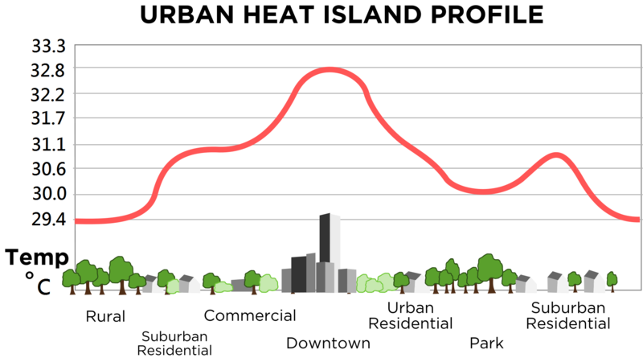
</center>
???

- The Urban Heat Island effect is where urbanized areas are warmer than neighboring rural areas

- As the population worldwide increases and urbanizes this is a major concern,
because these heat islands cause increased energy consumption, elevated emissions of air pollutants
and greenhouse gasses, compromised human health and comfort, and impaired water quality.

- That's what you can see here in this generalized profile. Notice that our y-axis is degrees celsius, so these changes can be quite large.

- So, what can be done about them?
- Well we know that they are caused because urban built structures hold more heat than the structures and vegetation in surrounding areas.  You can see this in the profile. 

- Knowledge about microclimates within cities can be incredibly useful in mitigating this issue because it can give information about prospective sites for climate risk adaptation. 

- Unfortuately this information can be difficult to obtain.

- One way to find these microclimates is by classification of satellite imagery

---

<center>
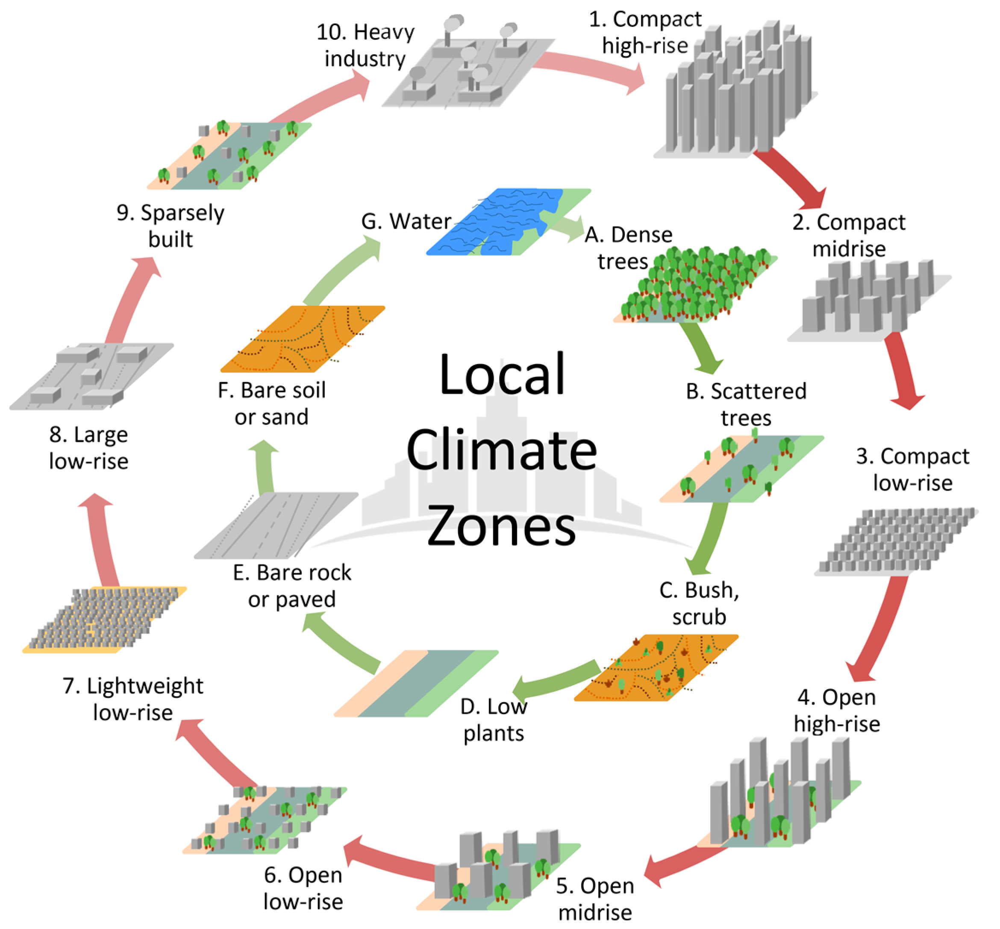
<br>
<font size = 2>
Originally created by Stewart and Oke (2012), reproduced by Bechtel et al. (2017), licensed under CC-BY 4.0
</font>
</center>

???

Here you can see one of the predominant classification schemes for urban areas.

- On the outside circle are the urban classes, they range from 1 to 10 and include varying levels of built structures. It's roughly grouped into high-rises, mid-rises, low-rises, sparsely built, and heavy industry.

- On the inside circle are the natural classes, which range from A to G and include trees, bushes and low plants, bare soil rock or sand, and water.

- Moving forward I'll talk about the natural classes as classes 11-17 rather than A-G.

---

# Objective

* Hong Kong
* Yoo
* WUDAPT
* ntree


???

---

# The LCZ reference data

<center>
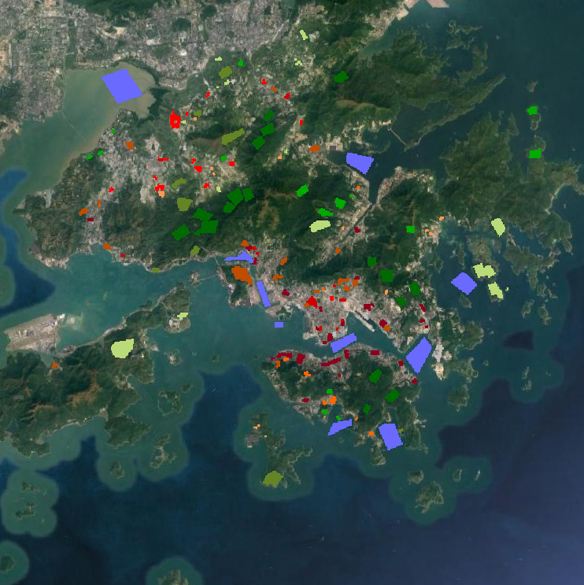
</center>


???


---

# The Landsat 8 data

<table>
<tr><td>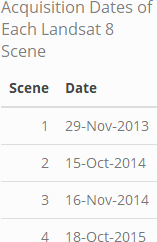</td> <td>
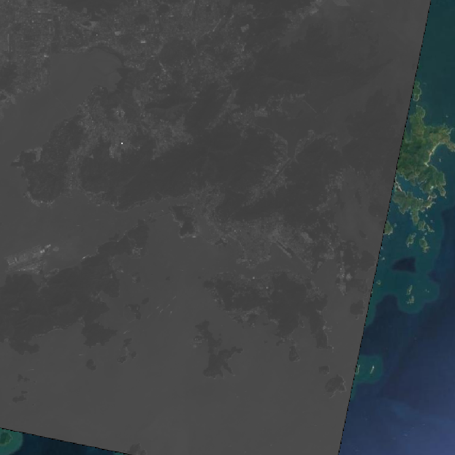</td></tr>
</table>

<!-- <p style="text-align:right;"> -->
<!-- Methods -->
<!-- </p> -->

???

All 9 available bands of all 4 Landsat scenes amounted to 36 input variables. Each pixel is an observation,

---

<!-- 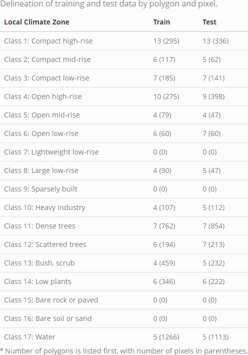 -->
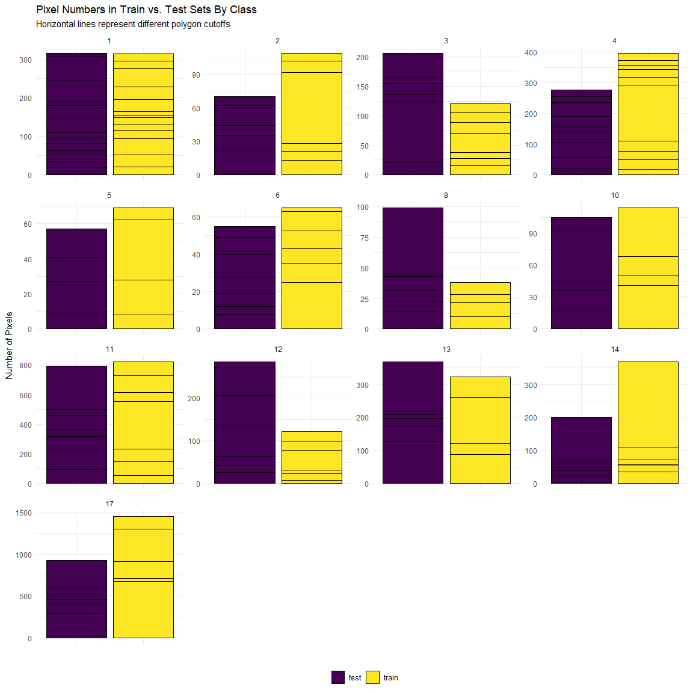

???

test is purple
train is yellow
---

# Decision Trees

???
think flow chart

---

# Impurity

Splits are typically evaluated by Gini impurity or entropy:

$$\text{Gini Impurity} =\ I_G(t)\  = 1 - \sum_{i=1}^{C}p(i|t)^2$$


Where: 
* $i$ is a class in the predictor variable, ranging from 1 to $C$.
* $C$ is the total number of classes represented for a particular node, $t$. 
* $p(i|t)$ is the proportion of samples that belong to each $i$, for a particular node $t$.

???

---

# Random Forests vs. Decision Trees

???

talk about prediction some ?

---

# Out-of-Bag Error

???

---

# Tuning Parameters

???

---


# Accuracy Assessment

<br>
$$\text{Overall Accuracy}= \text{OA}= \frac{\text{number of correctly classified reference sites}}{\text{total number of reference sites}}$$
--

<br>
$$F_1\text{ Score} = 2*\frac{UA*PA}{UA+PA}$$
--

<br>
$$UA(z)\ = \frac{\text{number of correctly identified pixels in class z}}{\text{total number of pixels identified as class z}}$$ 
--

<br>
$$PA(z) = \frac{\text{number of correctly identified pixels in class z}}{\text{number of pixels truly in class z}}$$

???

In line with the methods used in our reference paper and the remote sensing field, accuracy metrics will include the following:

$OA_{urb}$ and $OA_{nat}$ will be used, which are the same as overall $OA$ but only includes the urban and natural classes, respectively.

$UA$ is a measure of user's accuracy, which is also called precision or positive predictive value. $PA$ is the measure of producer's accuracy, also known as recall or sensitivity. The harmonic mean of $UA$ and $PA$ gives the $F_1$ score, which is a measure of the model's accuracy. An $F_1$ Score closer to 1 indicates a model that has both low false positives and low false negatives.

---
<br>
<br>
<br>
<br>
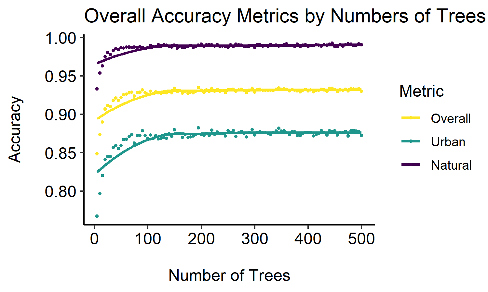

???
# Results: OA for 5 to 500

The parameter for the number of trees was initially varied between 5 and 500 at intervals of 5. The resulting overall accuracy metrics indicate a leveling off around 125 trees (Figure 2). There's also a clear distinction between accuracy in urban vs. natural classes, with natural classes having a much higher overall accuracy.

---

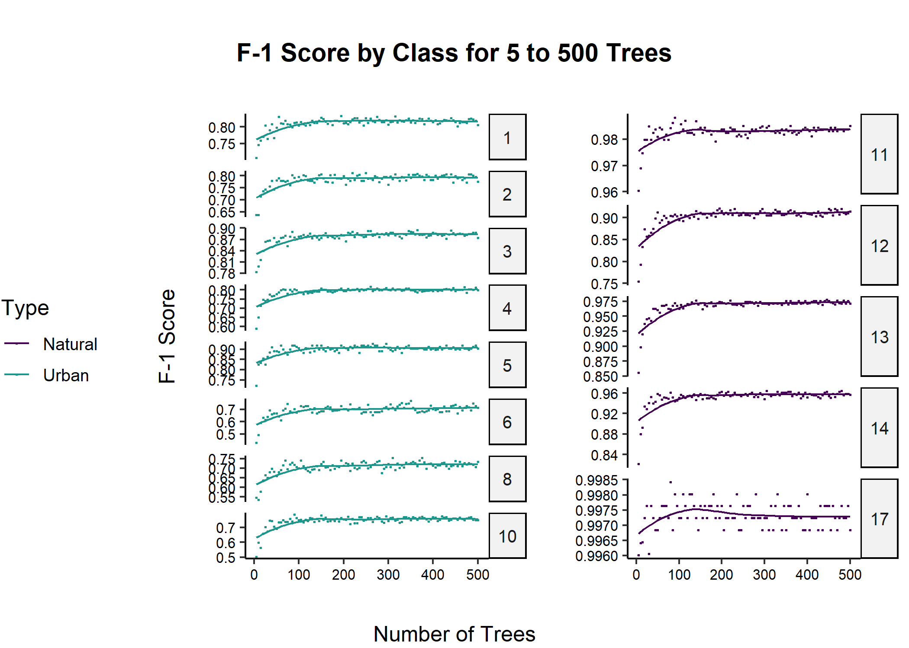

???

# Results: F-1 by Class 5 to 500

The variation between LCZ classes in F-1 score can be seen. As the number of trees in the random forest increases, F-1 score also increases, until around 100 trees. These metrics were calculated based on the out-of-bag dataset.

include larger plots for 500-2500 or just mention? Probably just mentio

---

<br>
<br>

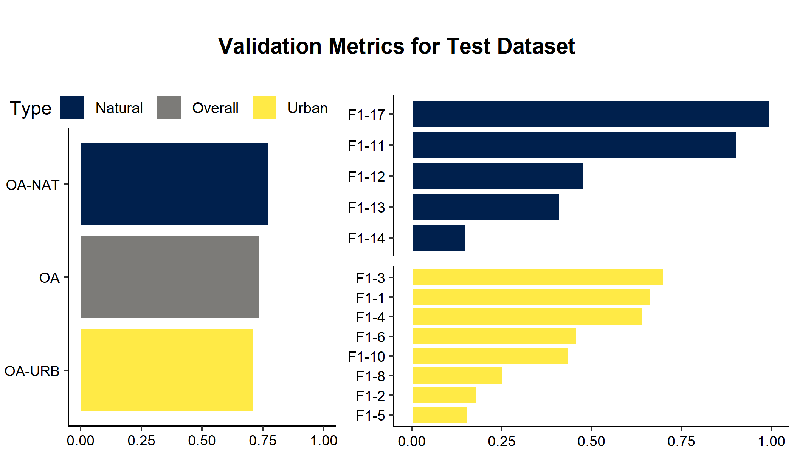

???

## Predicting on the Test Dataset

OA and F-1 metrics dropped dramatically upon applying the random forest to the test data (Figure 4).

Accuracy among random forest predictions for the test dataset varied widely, but was lower than expected for F-1 scores, which do not seem to agree with the OA metrics. Classes 2, 5, 8, and 14 have particularly low F-1 Scores

---
<br>
<br>
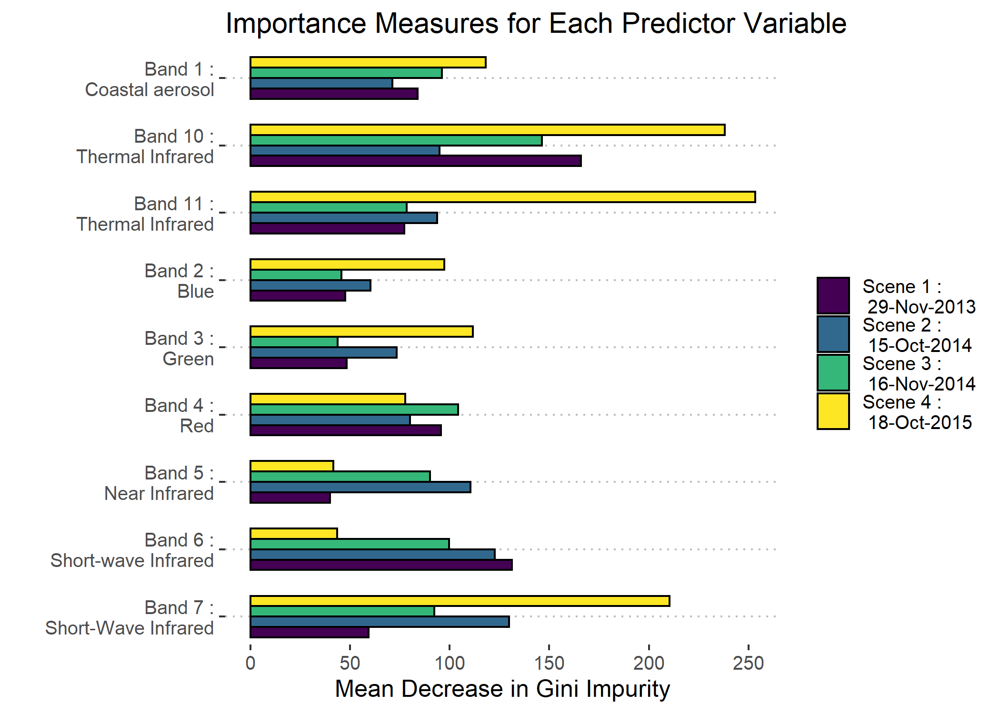

???

There is not a clear pattern in Mean Decrease for Gini Impurity between the different bands and scenes, though there is some indication that bands in scene 4 were particularly effective as predictors.

---

## Creating the Full Prediction

<table>
<tr><td>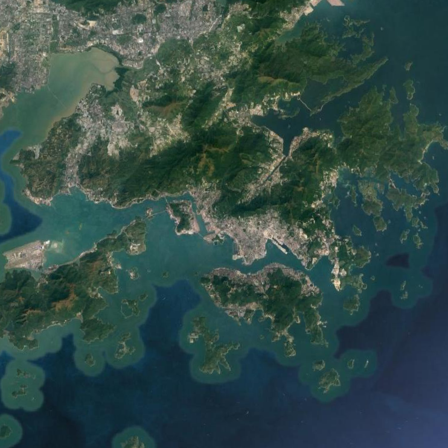</td> <td></td></tr>
<th>Google Maps Satellite Imagery</th><th>Landsat 8 Scene</th>
</table>

???
On the left is a google maps baselayer of the area of interest
On the right is the same baselayer with one Landsat 8 scene overlayed.

---

## Creating the Full Prediction
<center>
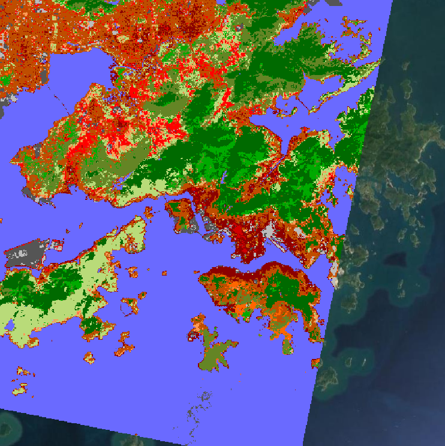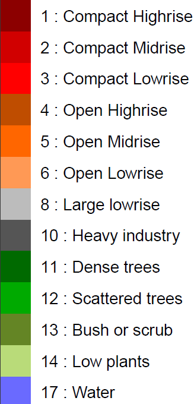
</center>
???

Here is the entire area of interest classified into local climate zones. 

---

# Conclusion

Overall Results:
* Low accuracy for prediction on the test data, in comparison to the out-of-bag data
* High OA values can mask low F1 scores within classes

--

<br>
Limitations:
* Reference polygons on account for ~3% of the Area of Interest
* Time constraints
--

<br>
Future Work:
* Multiple tuning parameters & Interactions between them
* Quantifying "how much" ground truth data is enough

???

---

# Questions?
 
All code and higher resolution images for this project can be found on GitHub at <https://github.com/erickabsmith/masters-project-lcz-classification>.


???

