class: center, middle inverse

# Local Climate Zone Classification Using Random Forests

## Ericka B. Smith

### 03/09/2021

```{r include=FALSE}
#xaringan::inf_mr()
#servr::daemon_stop(1)
# p for presenter mode, c for clone
```


---

class: center, middle

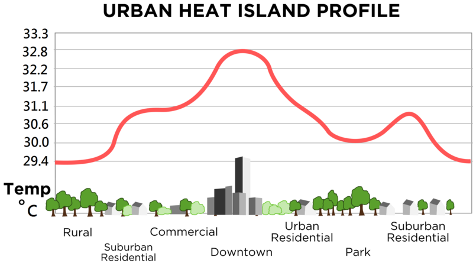

---
class: center

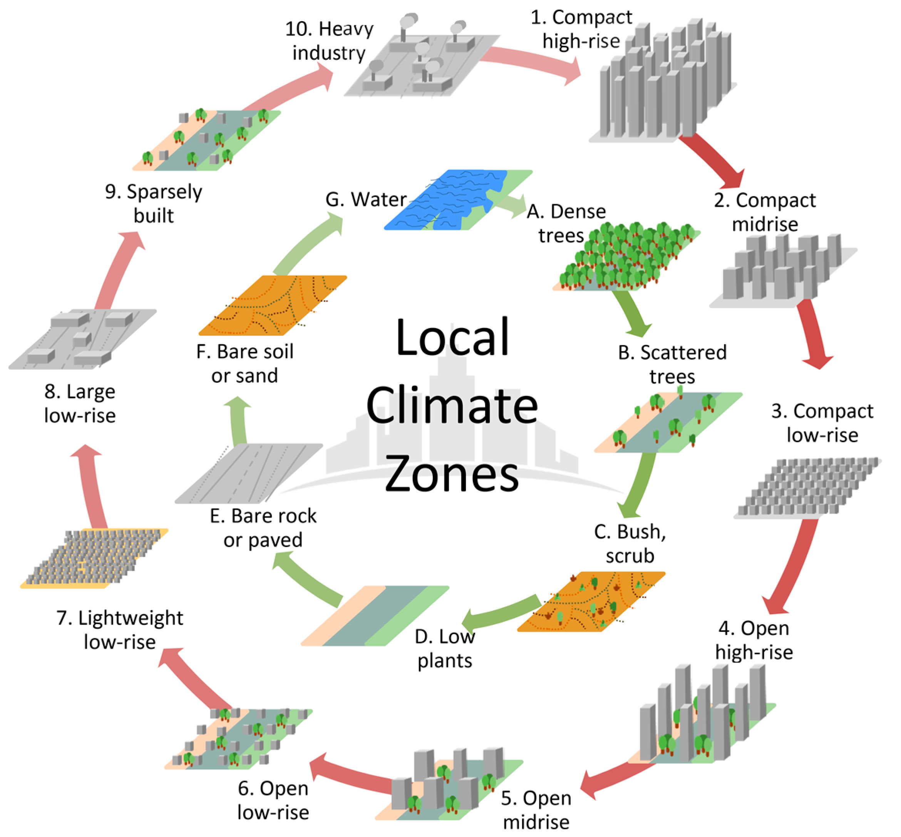
<br>
<font size = 2>
Originally created by Stewart and Oke (2012), reproduced by Bechtel et al. (2017), licensed under CC-BY 4.0
</font>


---

class: inverse


# Objective

<br>

Inspiration:
* *Comparison between convolutional neural networks and random forest for local climate zone classification in mega urban areas using Landsat Images* (Yoo et al., 2019)
<br>
<br>
<br>

My Focus: 
* Hong Kong
* Random Forests
* Varying the Number of Trees


---

# The LCZ reference data

<center>
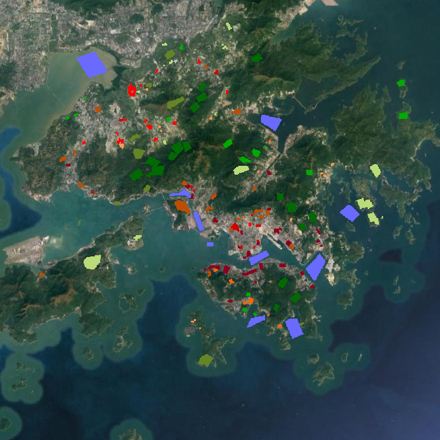
</center>


---

# The Landsat 8 data

<table>
<tr><td>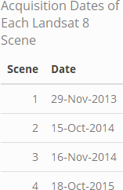</td> <td>
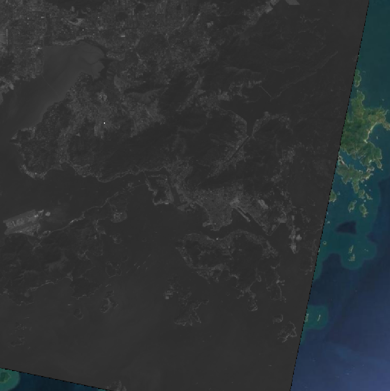</td></tr>
</table>


---
class: center

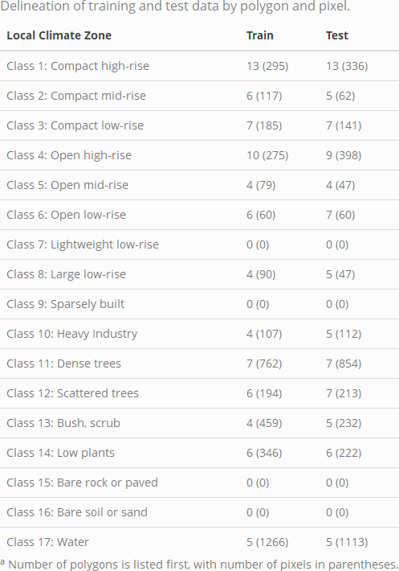

---

# Decision Trees
<center>
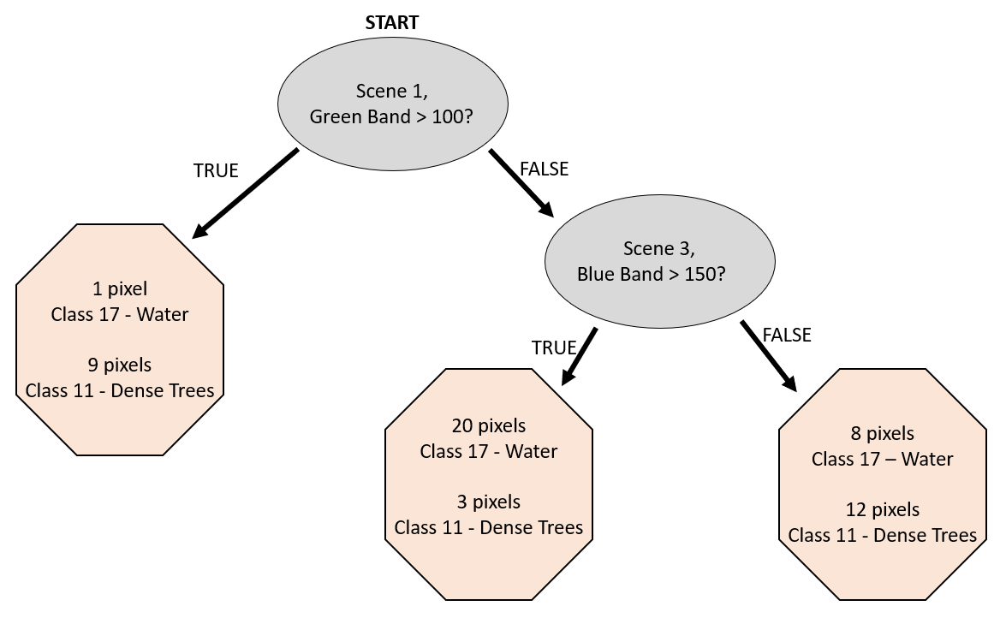
</center>


---

## Random Forests: a collection of decision trees
<center>

<br>
<br>
<font size = 2>
Created by Venkata Jagannath, licensed under CC BY-SA 4.0
</font>
</center>


---
class: inverse, middle

## Why is it a [**Random**] Forest?

* Randomizing variables tried at each node
<br>

* Bootstrapping samples for each tree 

---

# Out-of-Bag Error

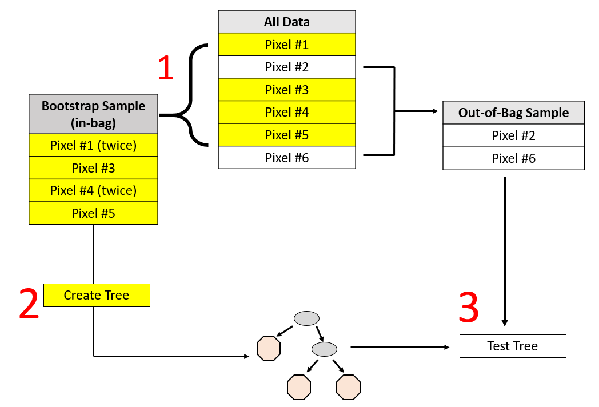

---

# Tuning Parameters
<br>
$$\text{ntree = varied}$$
<br>
<br>

$$\text{mtry} =\sqrt{\#\text{ of parameters}}=\sqrt{36} = 6$$
<br>
<br>
$$\text{nodesize}=1$$
<br>
<br>
$$\text{maxnodes = maximum possible}$$

---


# Accuracy Assessment

<br>
$$\text{Overall Accuracy}= \text{OA}= \frac{\text{number of correctly classified reference sites}}{\text{total number of reference sites}}$$

--

<br>
$$F_1\text{ Score} = 2*\frac{UA*PA}{UA+PA}$$

--

<br>
$$UA(z)\ = \frac{\text{number of correctly identified pixels in class z}}{\text{total number of pixels identified as class z}}$$ 

???
- is a measure of user's accuracy, which is also called precision or positive predictive value. 

**and, PA,**
--

<br>
$$PA(z) = \frac{\text{number of correctly identified pixels in class z}}{\text{number of pixels truly in class z}}$$

---

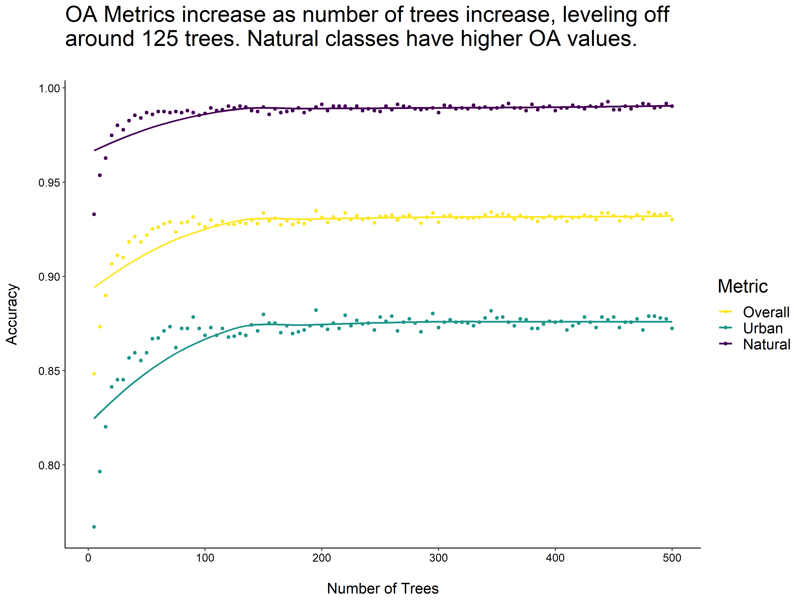

---

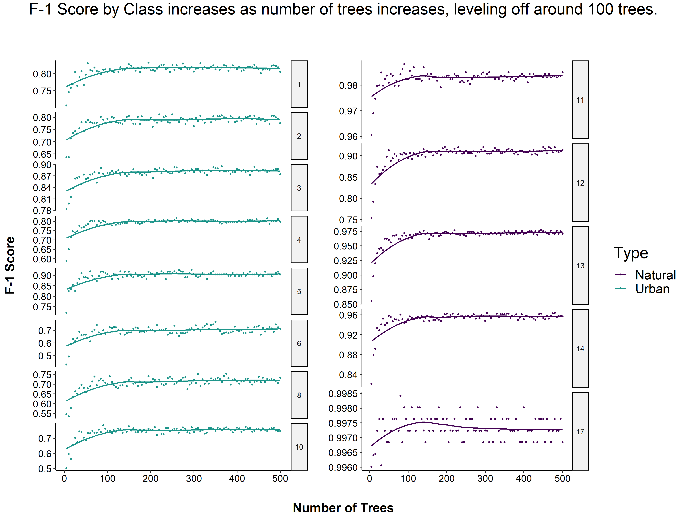

---

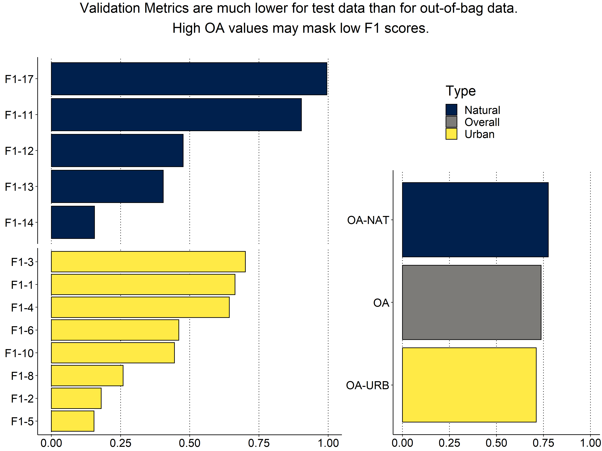

---

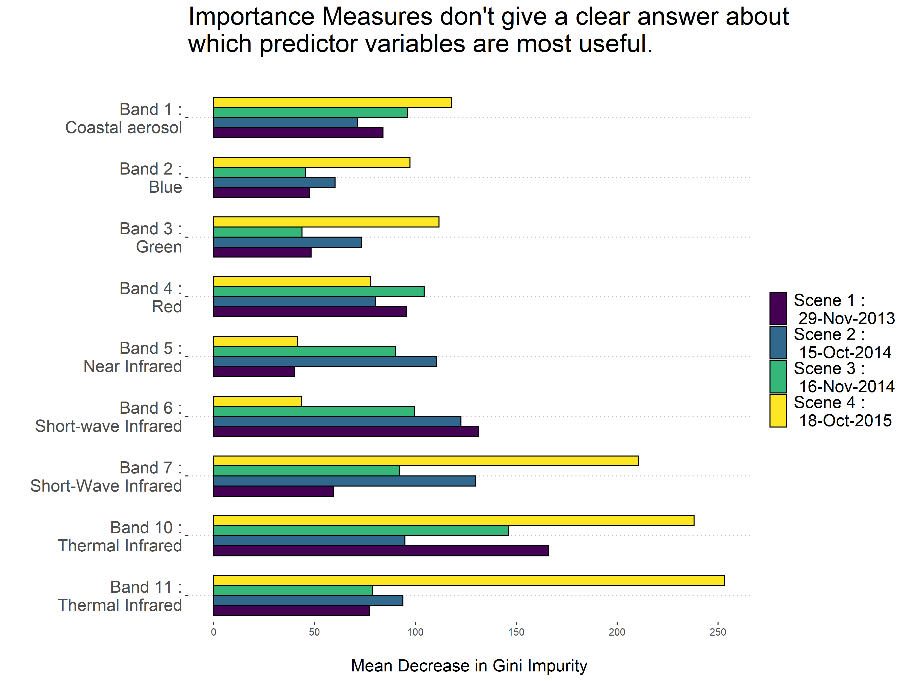

---

class: inverse

## Creating the Full Prediction

<table>
<th>LCZ Polygons</th><th>Scene 1, Band 4</th>
<tr><td></td> <td></td></tr>
</table>

---

class: inverse

## Creating the Full Prediction

<table>
<tr><td>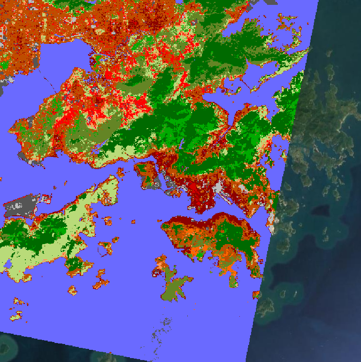</td>
<td>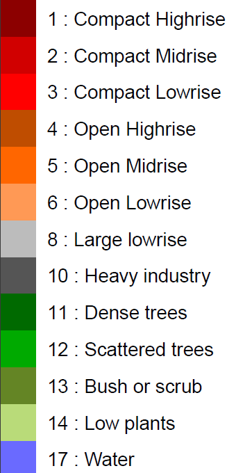</td></tr>
</table>

---

# Conclusion

Overall Results:
* Low accuracy for prediction on the test data, in comparison to the out-of-bag data
* High OA values can mask low F1 scores within classes

--

<br>
Limitations:
* Reference polygons on account for ~3% of the Area of Interest
* Time constraints

--

<br>

Future Work:
* Multiple tuning parameters & the interactions between them
* Quantifying how many reference polygons are "enough"

---

class: center, middle

background-image: url("images/hk1.JPG")

background-size: contain

# Acknowledgements
<br>
<br>
<br>
.


---
<br>
<br>
<br>
<br>

# Questions?

<br>
 
All code and higher resolution images for this project can be found on GitHub at <https://github.com/erickabsmith/masters-project-lcz-classification>.


???

Now I'll take any questions if you have them.