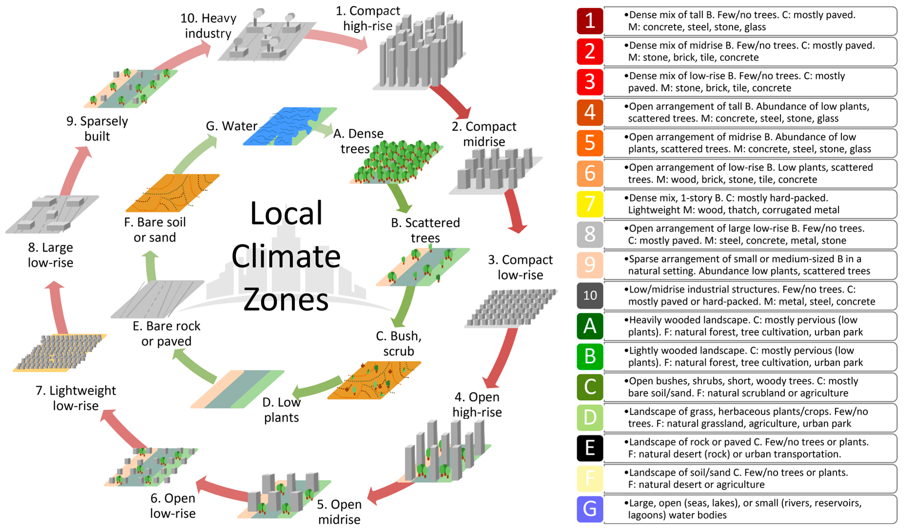

```{r setup, include=FALSE}
knitr::opts_chunk$set(echo = TRUE)
library(kableExtra)
library(here)
```

# Introduction

## Background

The population worldwide is increasing and urbanizing (United Nations et al., 2019). In addition, issues surrounding environmental change and pollution are exacerbated in cities (Bechtel et al., 2015) (Santamouris, 2020). These changes compound the effects of each other and, as a result, a greater understanding of these processes is more important now than ever before (Bechtel et al., 2015).

Urban Heat Islands, where urban areas are warmer than the neighboring rural areas, are of particular concern. This is for four primary reasons: increased energy consumption, elevated emissions of air pollutants and greenhouse gasses, compromised human health and comfort, and impaired water quality (US EPA, 2014). A multitude of processes combine to cause Urban Heat Islands. Broadly speaking, urban built structures hold more heat than the structures and vegetation in surrounding areas (Hibbard et al., 2017). In particular, cities have an overabundance of impervious surfaces, along with a lack of vegetation (Hibbard et al., 2017). Knowledge about microclimates within cities, especially in the context of prospective sites for climate risk adaptation efforts, has the potential to ease some of these disturbances (Lempert et al., 2018) .

Unfortunately, information on these sites can be difficult to obtain. Though there is a plethora of satellite imagery, the current methods to classify this imagery are not always accurate. (Yokoya et al., 2018). Historically the focus was on the broad categories of urban vs. rural, which does not give enough information about the nuanced climate within a large urban area (Stewart & Oke, 2012). Local Climate Zone (LCZ) classification was created by Stewart and Oke (2012) (Figure 1) to alleviate this problem, but it often requires a significant investment from individuals with specialist knowledge to successfully classify a city (Bechtel et al., 2015). Even the best models have low accuracy outside of their training city (Verdonck et al., 2017) (Yokoya et al., 2018). Therefore, this issue with generalizing a model to other cities, transferability, is a topic of great interest in current Urban Heat Island research (Tuia et al., 2017) (Yokoya et al., 2018).




## Objective

The goal of this project is to recreate aspects of the article Comparison between convolutional neural networks and random forest for local climate zone classification in mega urban areas using Landsat images (Yoo et al., 2019), where methods for predicting LCZ classes for four large cities throughout the world were compared. To do so, a small training dataset from the 2017 Institute of Electrical and Electronics Engineers (IEEE) Geoscience and Remote Sensing Society (GRSS) Data Fusion Contest (Tuia et al., 2017) was used as ground truth for LCZ classes. This was combined with satellite input data to create a series of models, which were then compared to a larger, full LCZ layer for each city and assessed for accuracy. The primary types of models considered in the Yoo et al. (2019) work were random forests and convolutional neural networks. However, for this project the focus will be only on random forests. In addition, rather than four cities, this investigation will focus on just Hong Kong. This city was chosen due to its lack of "red-star classes" (LCZ classes with 3 or fewer polygons) in the study area. The red-star classes add complexity to the splitting up of the data into training and test sets. Since they by nature address only rare classes, this complexity was deemed unnecessary for this project. Finally, here;, a classification scheme like the one used by the World Urban Database and Access Portal Tools (WUDAPT) project, denoted as Scheme 1 (S1) in Yoo et al. (2019) will be the focus, with comparisons between accuracy using a variety of tuning parameters.

# Methods

## Data

Data for this analysis was accessed from the 2017 IEEE GRSS Data Fusion Contest. Only the Hong Kong LCZ reference and Landsat 8 datasets were used.

The LCZ reference data from the contest set was taken from the WUDAPT database, checked for correctness, and then provided as a 100m resolution raster layer. In this provided layer the LCZ classes are numbered 1-17, rather than 1-10 and A-G, and initial inspection of the data verified that numbers 11-17 directly match classes A-G. In Yoo et al. (2019) the first step they took with the reference data was randomly dividing the polygons of each class into training and testing groups. This required some preprocessing since I only had access to the data in raster form and without any sort of polygon identification. Pixels within the same polygon cannot be put into both training and validation groups because it will artificially increase accuracy metrics (Zhen et al., 2013). 

In Yoo et al. (2019) they downloaded and preprocessed their own Landsat 8 data to facilitate some of their classification schemes, but the contest data was sufficient for the narrower scope of this project. The Landsat 8 data provided by the contest includes four different dates, or “scenes,” each of which were downloaded from the USGS EarthExplorer portal. Then the atmospheric band (band 9) and the panchromatic band (band 8) were left out, and the data were resampled using the area weighted average to 100 m x 100 m grids (Yokoya et al., 2018). To get these data into a usable format they were loaded into R by band (each band is a separate raster layer) and stacked by scene. All the scenes were then stacked with the LCZ reference data and converted to a dataframe, ready to be used as input data.

All 9 available bands of all 4 Landsat scenes amounted to 36 input variables. Each pixel is an observation, with 279,312 pixels total over the almost 2,800 square kilometers that are contained within the area of interest. The LCZ reference data has 179 polygons, which cover 8,846 pixels. This is approximately 88.5 square kilometers and 3% of the total area of interest. The LCZ reference data was randomly split into training and test sets by LCZ class and polygon. The resulting groups are not exactly equal in pixel numbers, but I determined that randomization of polygons takes precedence over equality in pixels due to the potential for artificially high accuracy values, as mentioned before. In order to get as close as possible a barplot was made showing the number of pixels in training and test, by class, so that equality in pixel number could be explored without having knowledge of polygon groupings. Sampling was repeated until these bars looked marginally even. (Table 1).


```{r}
# TABLE 1
```

## Random Forests

Random forests consist of many decision trees. A decision tree can be used for classification or regression. Here I will focus on classification since my goal is to predict LCZ class, which is a categorical variable. Decision trees put each observation through a series of conditional statements, or splits, in order to group it with other observations that are similar. These similar groups are expected to have similar values for the predictor variable. Since the true value of the predictor variable is known for the observations in the training dataset, it is possible to measure the accuracy of each prospective split, and therefore to build an optimal tree. 

Each point in which the data could potentially be split into two groups is called a node. The first split is called the root node. Nodes are selected such that each one uses the conditional statement which subsets the data into the best possible split. When any more subsetting does not increase accuracy, the path ends, and this is called a leaf node. Any nodes between the root node and leaf nodes are called internal nodes.

Splits are typically evaluated by Gini impurity or entropy.

$$
\text{Gini Impurity} =\ I_G(t)\  = 1 - \sum_{i=1}^{C}p(i|t)^2
$$
$$
\text{Entropy} =\ I_H(t)\ = -\sum_{i=1}^{C}p(i|t)\log_2p(i|t)
$$

Where $i$ is a class in the predictor variable, ranging from 1 to $C$. $C$ is the total number of classes represented for a particular node, $t$. $p(i|t)$ is the proportion of samples that belong to each $i$, for a particular node $t$.

A Gini Impurity, or entropy, of 0 indicates a completely homogeneous group, which cannot be improved upon. These metrics are used for comparison: all possible variables and thresholds within those variables are tried and their Gini impurity or entropy calculated, the variable and threshold with the best (lowest) value selected for the node. This is done recursively at each node until no split offers a decrease in the metric of choice. The resulting collection of nodes is a decision tree. 

Decision trees perform quite poorly with new samples. Including a threshold value for the accuracy metric can help, as it keeps trees more simple, but they are still prone to overfitting. Collecting them into a random forest addresses this issue. True to its name, a random forest is a collection of decision trees that have a component of randomness. The predictive aspect of a random forest does not only rely on one tree, it is determined by totaling up the decisions, or “votes,” that all of the trees make.

Each tree is created individually and starts with bootstrapping the training dataset. Then the process is similar to the one described above for decision trees. However, for each node only a subset of the variables are randomly selected and used as candidates to split up the bootstrapped data. Not all the variables are used at each node because doing so reduces correlation and introduces randomness into the model. Whichever variable best splits the data will be the variable that is kept at that node in that specific tree. This is either done recursively until no more splits are beneficial (just as in a regular decision tree), or until minimum size of the node is reached. To create the next tree the process is the same, but starts completely over with a new bootstrap sample of the training data. This is repeated for a chosen number of trees.

This choice of the number of trees to create is a tuning parameter. Too many trees can be computationally expensive, but too few can create a model that is poor at prediction. Another important tuning parameter is the choice of how many variables to randomly select at each node. The default value for classification is typically the square root of the number of variables, and for regression it is the number of variables divided by three. Values for the minimum size of terminal nodes, which is the minimum number of observations required to make a leaf node, can also be varied. A large minimum size means smaller trees and faster completion of the random forest. This is an alternate strategy for controlling depth, which, in the randomForest package in R, cannot be directly controlled. Depth indicates the number of splits a tree has. Greater depth gives more information about the data. Another tuning parameter with a similar approach is the maximum number of terminal nodes a tree can have. Without setting this parameter, trees are grown as large as possible.   

To use a random forest to make predictions for a new set of input values, the values are fed into each decision tree individually. The predictions from each tree are combined either by direct vote (for categorical variables) or an average (for quantitative variables) and this becomes the final predicted result. This process is called bagging, because it is the action of bootstrapping the data to create each tree and using the aggregate to make a decision. Bagging is useful because it reduces variance without introducing bias. 

For this analysis, parameters were varied individually. This is limited in that it does not explore any potential interactions, but beneficial in that it is more clear the individual contribution of a parameter. The number of trees is the primary parameter of interest, since reducing it as much as possible can have a large impact on time and computational resources required.

## Accuracy Assessment

In line with the methods used in our reference paper and the remote sensing field, accuracy metrics will be based on predictions for the test dataset and will include the following:

$$
\text{Overall Accuracy}= OA= \frac{\text{number of correctly classified reference sites}}{\text{total number of reference sites}}
$$
$$
\text{Overall Accuracy in Urban Areas} = OA_{urb}\ = \frac{\text{number of correctly classified urban reference sites}}{\text{total number of urban reference sites}}
$$
$$
\text{Overall Accuracy in Natural Areas}=OA_{nat}\ = \frac{\text{number of correctly classified natural reference sites}}{\text{total number of natural reference sites}}
$$

Additionally, the $F_1$ score will be used. This is the harmonic mean of precision (user’s accuracy, UA) and recall (producer’s accuracy, PA). 

$$
UA(z)\ = \frac{\text{number of correctly identified pixels in class z}}{\text{total number of pixels identified as class z}}
$$
$$
PA(z) = \frac{\text{number of correctly identified pixels in class z}}{\text{number of pixels truly in class z}}
$$
$$
F_1\text{ Score} = 2*\frac{UA*PA}{UA+PA}
$$

# Results

## Varying the Parameter for Number of Trees

The parameter for the number of trees was initially varied between 5 and 500 at intervals of 5. The resulting overall accuracy metrics indicate a leveling off around 125 trees (Figure 2). There's also a clear distinction between accuracy in urban vs. natural classes, with natural classes having a much higher overall accuracy.

```{r image-ref-for-in-text, echo = FALSE, message=FALSE, fig.align='center', fig.cap='The increase in OA metrics levels off around 125 trees. Urban classes (1-10) have much lower accuracy than natural classes (11-17). These metrics were calculated based on the out-of-bag dataset.', out.width="100%", strip.white=TRUE, fig.pos='H'}
knitr::include_graphics("../results/plots/ntree_5_to_500_line_plot.pdf")
```

The plot of F-1 scores (Figure 3) explores each class individually. It's clear that there are three approximate groupings. The dense trees; scattered trees; bush, scrub; low plants; and water classes (11, 12, 13, 14, and 17, respectively) have the highest F-1 scores throughout, staying in the high 0.9 range almost irrespective of number of random forest trees, though scattered trees (12) stands out as a little lower than the others. The open low-rise, large low-rise, and heavy industry classes (6, 8, and 10, respectively) have much lower F-1 scores which are around 0.5 to 0.7. Finally, in the middle are the compact high-rise, compact mid-rise, compact low-rise, open high-rise, and open mid-rise classes (1-5, respectively), with F-1 scores hovering around 0.7 to 0.9.

```{r image-ref-for-in-text2, echo = FALSE, message=FALSE, fig.align='center', fig.cap='The variation between LCZ classes in F-1 score can be seen. As the number of trees in the random forest increases, F-1 score also increases, until around 100 trees. Note three approximate groupings of 1-5, 6-10, and 11-17. These metrics were calculated based on the out-of-bag dataset.', out.width="100%", fig.pos='H'}
knitr::include_graphics("../results/plots/ntree_5_to_500_heatmap.pdf")
```

Almost all of the classes' F-1 scores appear to respond to increased numbers of trees, to an extent. This response seems to stop entirely once the number of trees reaches 100, but to explore it more thoroughly I ran another simulation varying the number of trees between 25 and 2500 at intervals of 25. Increasing the number of trees has little to no effect on the F-1 score by class (Figure 4).

```{r image-ref-for-in-text3, echo = FALSE, message=FALSE, fig.align='center', fig.cap='The number of trees in the random forest does not seem to have a strong effect on the F-1 scores by class. This is based on the out-of-bag dataset and the number of trees was adjusted from 25 to 2500 in intervals of 25', out.width="100%", fig.pos='H'}
knitr::include_graphics("../results/plots/ntree_25_to_2500_heatmap.pdf")
```

## Predicting on the Test Dataset

### Accuracy

Accuracy metrics dropped dramatically upon applying the random forest to the test data (Figure 4). The F-1 Score for class 17, Water, remained high, but since water has a very characteristic signature this is not surprising. Classification for classes 2 (compact midrise), 5 (open midrise), 8 (large low-rise), and 14 (low plants) performed especially poorly.

```{r image-ref-for-in-text4, echo = FALSE, message=FALSE, fig.align='center', fig.cap='Accuracy among random forest predictions for the test dataset varied widely, but was overall lower than expected. Classes 2, 5, 8, and 14 have particularly low F-1 Scores', out.width="100%", fig.pos='H'}
knitr::include_graphics("../results/plots/test_set_accuracy_metrics_barplot.pdf")
```

### Importance Measures

In general there is not a clear pattern in which bands or scenes proved to be the best predictors based on mean decrease in Gini Impurity (Figure 5). However, bands 7, 10, and 11 in Scene 4 were particularly useful. Scene 4 overall seems to contribute the most effectively to the model, surpassing the other scenes in each of the bads except for 4,5, and 6. 

```{r image-ref-for-in-text5, echo = FALSE, message=FALSE, fig.align='center', fig.cap='There is not a clear pattern in Mean Decrease for Gini Impurity between the different bands and scenes, though there is some indication that bands in scene 4 were particularly effective as predictors.', out.width="100%", fig.pos='H'}
knitr::include_graphics("../results/plots/importance_barplot_ntree125.pdf")
```

## A full prediction

Despite the decreased overall accuracy for the random forest based on the test data, it is the best fitting model based on the training data,  and therefore the one I used for the full prediction of LCZ classes throughout the Hong Kong area of interest (Figure 6).

# Discussion

The results of this analysis point to an issue in the current method for using random forest to classify LCZ classes: Overall accuracy metrics can mask very low accuracy metrics in specific LCZ class categories. For example, water has an accuracy of almost 100% by every metric tested. It also takes up a large proportion of the training and test data, as well as the overall area of interest. As has been mentioned, the signature for water is quite distinctive (CITE). Therefore it's reasonable to suggest that the high rate of correct predictions is not due to the suitability of random forest classification for LCZ classes, but rather it may be due to the general ease of classifying water with Landsat 8 imagery, despite method used.

That being said, there are a number of other reasons this discrepancy in accuracy between classes could be occuring. The uneven distribution of polygons in different classes in our training dataset is likely an important contributor. The small proportion of training and test pixels relative to the entire are of interest also may be cause for concern. However, the latter is not actually tested for our accuracy methods due to lack of a fully classified ground truth layer. Without this layer it's not possible to test the transferability of these models to other urban areas, but, based on the classification success within Hong Kong it's likely that transferability is poor. 

In terms of my results varying the parameters of the random forest, there's an upper limit to how accurate the model can be. That upper limit may be in part due to the appropriateness of the method, but I postulate that the quality and amount of data is the true culprit. I suggest this as an area for future study, as it would be valuable to understand what level of initial classification commitment is necessary for a robust LCZ analysis.

\newpage

# References

* Bechtel, B., Alexander, P., Böhner, J., Ching, J., Conrad, O., Feddema, J., Mills, G., See, L., & Stewart, I. (2015). Mapping Local Climate Zones for a Worldwide Database of the Form and Function of Cities. ISPRS International Journal of Geo-Information, 4(1), 199–219. https://doi.org/10.3390/ijgi4010199
* Danylo, O., See, L., Bechtel, B., Schepaschenko, D., & Fritz, S. (2016). Contributing to WUDAPT: A Local Climate Zone Classification of Two Cities in Ukraine. IEEE Journal of Selected Topics in Applied Earth Observations and Remote Sensing, 9(5), 1841–1853. https://doi.org/10.1109/JSTARS.2016.2539977
* Demuzere, Matthias; Hankey, Steve; Mills, Gerald; Zhang, Wenwen; Lu, Tianjun; Bechtel, Benjamin (2020): CONUS-wide LCZ map and Training Areas. figshare. Dataset. https://doi.org/10.6084/m9.figshare.11416950.v1 
* Hibbard, K. A., Hoffman, F. M., Huntzinger, D., West, T. O., Wuebbles, D. J., Fahey, D. W., Hibbard, K. A., Dokken, D. J., Stewart, B. C., & Maycock, T. K. (2017). Ch. 10: Changes in Land Cover and Terrestrial Biogeochemistry. Climate Science Special Report: Fourth National Climate Assessment, Volume I. U.S. Global Change Research Program. https://doi.org/10.7930/J0416V6X
* Lempert, R. J., Arnold, J. R., Pulwarty, R. S., Gordon, K., Greig, K., Hawkins-Hoffman, C., Sands, D., & Werrell, C. (2018). Chapter 28: Adaptation Response. Impacts, Risks, and Adaptation in the United States: The Fourth National Climate Assessment, Volume II. U.S. Global Change Research Program. https://doi.org/10.7930/NCA4.2018.CH28
* Santamouris, M. (2020). Recent progress on urban overheating and heat island research. Integrated assessment of the energy, environmental, vulnerability and health impact. Synergies with the global climate change. Energy and Buildings, 207, 109482. https://doi.org/10.1016/j.enbuild.2019.109482
* Stewart, I. D., & Oke, T. R. (2012). Local Climate Zones for Urban Temperature Studies. Bulletin of the American Meteorological Society, 93(12), 1879–1900. https://doi.org/10.1175/BAMS-D-11-00019.1
* Tuia, D., Moser, G., Le Saux, B., Bechtel, B., & See, L. (2017). 2017 IEEE GRSS Data Fusion Contest: Open Data for Global Multimodal Land Use Classification [Technical Committees]. IEEE Geoscience and Remote Sensing Magazine, 5(1), 70–73. https://doi.org/10.1109/MGRS.2016.2645380
* United Nations, Department of Economic and Social Affairs, & Population Division. (2019). World urbanization prospects: The 2018 revision.
* US EPA, O. (2014, June 17). Heat Island Impacts [Overviews and Factsheets]. US EPA. https://www.epa.gov/heatislands/heat-island-impacts
* Verdonck, M.-L., Okujeni, A., van der Linden, S., Demuzere, M., De Wulf, R., & Van Coillie, F. (2017). Influence of neighbourhood information on ‘Local Climate Zone’ mapping in heterogeneous cities. International Journal of Applied Earth Observation and Geoinformation, 62, 102–113. https://doi.org/10.1016/j.jag.2017.05.017
* Yokoya, N., Ghamisi, P., Xia, J., Sukhanov, S., Heremans, R., Tankoyeu, I., Bechtel, B., Saux, B. L., & Moser, G. (2018). Open Data for Global Multimodal Land Use Classification: Outcome of the 2017 IEEE GRSS Data Fusion Contest. IEEE Journal of Selected Topics in Applied Earth Observations and Remote Sensing, 11(5), 15.
* Yoo, C., Han, D., Im, J., & Bechtel, B. (2019). Comparison between convolutional neural networks and random forest for local climate zone classification in mega urban areas using Landsat images. ISPRS Journal of Photogrammetry and Remote Sensing, 157, 155–170. https://doi.org/10.1016/j.isprsjprs.2019.09.009
* Zhen, Z., Quackenbush, L. J., Stehman, S. V., & Zhang, L. (2013). Impact of training and validation sample selection on classification accuracy and accuracy assessment when using reference polygons in object-based classification. International Journal of Remote Sensing, 34(19), 6914–6930. https://doi.org/10.1080/01431161.2013.810822
